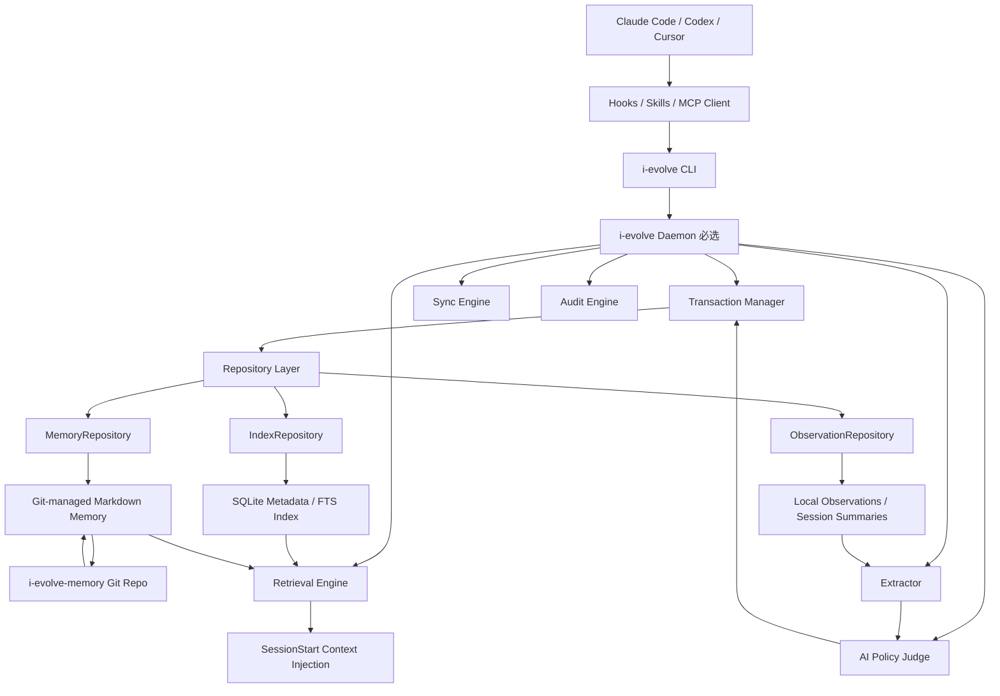
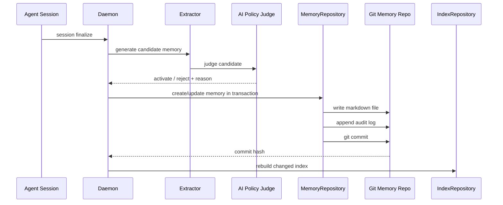

# I-Evolve：面向 Coding Agent 的跨仓自我进化记忆系统实施 Spec

> 版本：v0.3.0  
> 日期：2026-06-12  
> 状态：可实施修订稿  
> 本版重点变更：明确 **Markdown/Git 是 Memory 唯一事实源**；明确 **Daemon 是必选本地运行时**；补充 **事务、锁、版本号、乐观并发控制**；新增统一 Repository 接口；去除人工审核作为必经流程，改为 **AI 自动审核 + 审计日志 + Git 可回滚**；重新修复 MVP 实施顺序。

---

## 0. 文档目标

本文档用于指导实现 **I-Evolve**：一个面向 Claude Code / Codex / Cursor / 其他 Coding Agent 的本地优先、Git 版本化、跨仓库可召回、可审计、可回滚、可自动进化的项目级记忆系统。

I-Evolve 的目标不是让 AI 无限自动扩张规则，而是建立一个确定性闭环：

```text
观察 Agent 行为
→ 记录结构化 Observation
→ 会话结束生成 Session Summary
→ AI 提炼 Candidate Memory / Candidate Instinct
→ AI Policy Judge 自动判断是否激活
→ 写入 Git-managed Markdown Memory
→ Daemon 重建本地 SQLite / FTS 派生索引
→ 下次会话按 repo / project / domain / task 精确召回
→ 使用后继续验证、强化、降级、废弃或回滚
```

本版 Spec 明确采用以下长期形态：

```text
1. i-evolve monorepo
   维护 CLI、daemon、core、Claude Code plugin、MCP server、schema、SDK、测试等核心代码。

2. i-evolve-memory Git 仓库
   维护唯一远程 Memory：Git-managed Markdown 文件。
   Git 负责版本、同步、审计、回滚。

3. ~/.i-evolve 本地运行目录
   维护 daemon runtime、observations、session summaries、SQLite/FTS 派生索引、logs、local clone 等。
```

一句话定义：

> I-Evolve 是一个以 Git-managed Markdown Memory 为唯一事实源、以 Daemon 为必选本地运行时、以 SQLite/FTS 为派生索引、以 AI 自动审核为默认治理方式、面向多仓库 Coding Agent 的跨仓记忆系统。

---

## 1. 背景与核心判断

在使用 Claude Code / Codex / Cursor 等 Coding Agent 时，经常出现以下问题：

- 每次进入仓库都要重复解释项目结构、启动方式、业务规则和历史约束。
- Agent 容易忘记用户偏好，例如输出格式、是否需要 Mermaid、是否要 Markdown 文件、是否需要技术/非技术双版本结论。
- Agent 容易重复犯错，例如未读取文件就修改、误把一次性任务约束提升为长期规则、自动新增范围外内容。
- 项目规则跨会话、跨仓库、跨用户难以沉淀。
- 团队共享知识缺乏版本化、过期、回滚机制。
- 单纯依赖 `CLAUDE.md` 容易膨胀，且无法做到精确召回。

因此，本项目应被设计成 **Coding Agent 的跨仓长期记忆系统**，而不是普通聊天机器人的 memory layer。

---

## 2. 设计原则

### 2.1 Markdown/Git 是 Memory 唯一事实源

Memory 的主存储不是 SQLite，不是向量库，也不是 Daemon 内存状态。

```text
Memory Source of Truth = Git 管理的一系列 Markdown 文件
SQLite = 本地派生元数据索引
FTS / Vector = 本地派生检索索引
Daemon Runtime = 本地运行状态
Observation = 本地事件材料，不是长期 Memory 主存储
```

硬规则：

```text
1. 所有 active / deprecated / rejected / superseded memory 都以 Markdown 文件为准。
2. SQLite 只保存由 Markdown 构建出的元数据索引。
3. FTS / vector index 只保存检索用派生数据。
4. SQLite / index 损坏时，必须可以从 Markdown 全量重建。
5. Memory 的版本由 Git commit / tag / branch 管理。
6. 对 memory 的任何变更，本质都是对 Markdown 文件的变更。
```

### 2.2 Daemon 是必选运行时

Daemon 不再是“可选但推荐”，而是 I-Evolve 的必选运行时。

```text
CLI 是 daemon client。
Hooks 调用 CLI，但 CLI 必须转发给 daemon。
MCP server 必须通过 daemon 或 daemon 内置 worker 访问存储。
Daemon 是唯一写协调者。
```

允许无 daemon 执行的命令仅限：

```bash
i-evolve daemon start
i-evolve daemon status
i-evolve doctor --bootstrap
i-evolve repair --rebuild-index
```

除此之外，所有写操作必须依赖 daemon。

### 2.3 AI 自动审核，但必须可审计、可回滚

本版取消“人工审核作为必经流程”，改为：

```text
AI Extractor 生成 candidate
→ AI Policy Judge 判断是否激活
→ 自动写入 Git-managed Markdown
→ 写入 audit log
→ Git commit 版本化
```

注意：这不是 no review，而是 **AI review by default**。

每一次 AI 自动判断都必须留下：

```text
- decision
- reason
- confidence
- scope_reason
- policy_checks
- before_hash / after_hash
- source_refs
- actor_id
- git_commit
```

### 2.4 跨仓 Memory，但必须有作用域约束

Memory 是跨仓的，但不是无条件全局注入。

所有 memory 都统一存储在 `i-evolve-memory`，通过以下字段决定召回范围：

```text
repo_id
project_id
domain
tags
applies_to
scope
```

原则：

```text
1. repo_id 精确匹配优先。
2. project_id 匹配其次。
3. domain 匹配再次。
4. global 最后。
5. applies_to 可以让一条 memory 被多个仓库共享。
6. 没有匹配依据的 project memory 不允许跨仓注入。
```

### 2.5 先分层过滤，再 Top-K

检索不做复杂规则引擎，MVP 使用简单 Top-K，但必须先按 scope / status / priority 过滤。

```text
先过滤不可注入内容
→ 再按 scope 优先级分层
→ 层内按 score Top-K
→ 最终裁剪 token budget
```

### 2.6 规则必须可过期、可废弃、可替代

每条长期 memory 必须支持：

```text
status
confidence
source_refs
created_at / updated_at
expires_at 或 ttl_days
supersedes / deprecated_by
audit trail
git revision
```

### 2.7 能写项目规则，就不要写全局规则

全局规则必须极度克制。一次性任务约束不能提升为全局记忆。

错误示例：

```text
用户所有需求都不新增埋点。
```

正确示例：

```text
在 bilibili-column 项目的某次详情页改造需求中，用户明确要求本次不新增埋点。
```

---

## 3. 总体架构



### 3.1 分层说明

| 层 | 模块 | 作用 |
|---|---|---|
| Agent 入口层 | Claude Code Plugin / Skills / Hooks / MCP | 与具体 Agent 工具集成 |
| 命令层 | CLI | 用户命令入口；作为 daemon client |
| 运行时层 | Daemon | 必选；负责写协调、队列、索引、同步、AI 审核、MCP runtime |
| 事务层 | Transaction Manager | 锁、事务、版本号、乐观并发、回滚边界 |
| Repository 层 | Memory / Observation / Index Repository | 统一读写接口 |
| 主存储层 | Git-managed Markdown | Memory 唯一事实源 |
| 派生索引层 | SQLite / FTS / Vector | 本地可重建索引 |
| 治理层 | AI Policy Judge / Audit / Git History | 自动审核、审计、回滚、安全 |

---

## 4. 仓库规划

## 4.1 核心代码 Monorepo：`i-evolve`

推荐使用 TypeScript monorepo。原因：

- Claude Code Plugin / Hooks / Skills 与 Node/TS 生态匹配。
- CLI、MCP server、daemon 可以统一复用 core package。
- pnpm workspace 便于多包管理。
- 后续如需高性能本地索引，可单独引入 Rust/Go native module，但不影响 MVP。

推荐目录：

```text
i-evolve/
  package.json
  pnpm-workspace.yaml
  turbo.json 或 nx.json
  tsconfig.base.json
  README.md
  CHANGELOG.md

  apps/
    cli/
      src/index.ts
      package.json
    daemon/
      src/main.ts
      src/ipc.ts
      src/scheduler.ts
      src/queue.ts
      src/lock.ts
      src/transaction.ts
      package.json
    mcp-server/
      src/server.ts
      package.json
    dashboard/
      src/
      package.json
      # 可选，后续做

  packages/
    core/
      src/memory/
      src/observation/
      src/session/
      src/retrieval/
      src/evolution/
      src/policy/
      src/audit/
      src/project/
      src/config/
      package.json

    schema/
      schemas/
        observation.schema.json
        session-summary.schema.json
        memory.schema.json
        instinct.schema.json
        audit-action.schema.json
        memory-pack.schema.json
        project-profile.schema.json
      src/index.ts
      package.json

    repository/
      src/MemoryRepository.ts
      src/ObservationRepository.ts
      src/IndexRepository.ts
      src/TransactionManager.ts
      package.json

    storage-markdown/
      src/frontmatter.ts
      src/markdownMemoryStore.ts
      src/atomicWrite.ts
      package.json

    storage-sqlite/
      src/index.ts
      migrations/
      package.json

    git-memory/
      src/sync.ts
      src/commit.ts
      src/rollback.ts
      src/validateRepo.ts
      package.json

    embedding/
      src/provider.ts
      src/noop.ts
      src/local.ts
      src/openai-compatible.ts
      package.json
      # MVP 使用 FTS，后续再接 embedding

    claude-plugin/
      .claude-plugin/plugin.json
      hooks/hooks.json
      skills/
        init/SKILL.md
        remember/SKILL.md
        audit/SKILL.md
        forget/SKILL.md
        explain-memory/SKILL.md
      package.json

    shared/
      src/types.ts
      src/errors.ts
      src/constants.ts
      package.json

  templates/
    memory.md
    instinct.md
    audit-action.md
    session-summary.md
    project-profile.md

  tests/
    unit/
    integration/
    e2e/
    fixtures/
      repo-basic/
      memory-repo-basic/
    golden/
      inject-context.snap.md
```

### 4.2 包职责边界

| Package / App | 职责 | MVP 阶段 |
|---|---|---:|
| `apps/cli` | 用户命令入口，daemon client | MVP1 |
| `apps/daemon` | 必选运行时、队列、事务、索引、同步、AI 审核 | MVP1 |
| `apps/mcp-server` | 跨客户端 memory 服务 | MVP7 |
| `apps/dashboard` | 可视化审计与回滚 | 可选 |
| `packages/core` | 领域模型和核心逻辑 | MVP0 |
| `packages/schema` | JSON Schema、类型生成、校验 | MVP0 |
| `packages/repository` | 统一 Repository 接口 | MVP0 |
| `packages/storage-markdown` | Markdown + frontmatter 主存储读写 | MVP0 |
| `packages/storage-sqlite` | 本地派生索引 | MVP2 |
| `packages/git-memory` | Git 同步、commit、rollback、validate | MVP5 |
| `packages/embedding` | FTS / embedding / 向量检索适配 | MVP 后续 |
| `packages/claude-plugin` | Claude Code Plugin、Hooks、Skills | MVP4 |
| `packages/shared` | 通用类型、错误、常量 | MVP0 |

### 4.3 Monorepo 命令

```bash
pnpm install
pnpm build
pnpm test
pnpm lint
pnpm typecheck
pnpm dev:cli
pnpm dev:daemon
pnpm release
```

根目录脚本建议：

```json
{
  "scripts": {
    "build": "turbo run build",
    "test": "turbo run test",
    "lint": "turbo run lint",
    "typecheck": "turbo run typecheck",
    "dev:cli": "pnpm --filter @i-evolve/cli dev",
    "dev:daemon": "pnpm --filter @i-evolve/daemon dev",
    "validate:schema": "pnpm --filter @i-evolve/schema validate",
    "release": "changeset version && changeset publish"
  }
}
```

---

## 5. 远程 Memory Git 仓库：`i-evolve-memory`

远程 Memory 只有一份，由 Git 管理多版本。

```text
Remote Memory Repo 只有一份。
版本由 Git 管理。
本地可以 checkout 指定 branch/tag/commit。
```

推荐结构：

```text
i-evolve-memory/
  README.md
  CHANGELOG.md
  memory-pack.yaml

  global/
    output-style.md
    code-editing-rules.md
    safety-rules.md

  domains/
    prd/
      prd-style.md
      no-extra-tracking.md
    ssr/
      hydration-checklist.md
      no-ssr-pages.md
    llm-wiki/
      update-policy.md
      export-template.md

  projects/
    bilibili-column/
      project-profile.md
      architecture.md
      business-rules.md
      pitfalls.md
      decisions.md

  repos/
    bilibili-column-web/
      repo-profile.md
      local-rules.md
      build-rules.md
      known-pitfalls.md

  users/
    minntaki/
      output-preferences.md
      workflow-preferences.md

  instincts/
    active/
      read-before-edit.md
      no-auto-commit.md
      scope-before-global.md
    deprecated/
      old-ssr-rules.md

  audit/
    2026-06/
      memory-audit.jsonl

  tombstones/
    forgotten-memory.md

  schemas/
    memory.schema.json
    instinct.schema.json
    audit-action.schema.json
    memory-pack.schema.json

  migrations/
    001_add_scope_field.ts
    002_add_revision_and_hash.ts

  tests/
    fixtures/
    golden/
      inject-context.snap.md
```

### 5.1 Memory Pack 元信息

`memory-pack.yaml`：

```yaml
id: team.default
name: Team Default Memory Pack
version: 2026.06.12
schema_version: 2
visibility: team
owners:
  - frontend-platform
remote:
  type: git
  default_branch: main
  current_commit: null
sync:
  auto_pull: true
  auto_push: true
ai_review:
  enabled: true
  policy: i-evolve-policy-v1
  min_confidence_to_activate: 0.82
  min_confidence_for_global: 0.92
```

### 5.2 Memory 文件格式

Markdown frontmatter 使用 `snake_case`；TypeScript 内部使用 `camelCase`，由 schema mapping 显式转换。

```md
---
id: project.bilibili-column.business.old-editor-return-button
type: project_fact
scope: project
project_id: bilibili-column
repo_id: null
domain: content-editor
status: active
visibility: team
confidence: 0.92
owner: frontend-platform
created_at: 2026-06-12T10:00:00+08:00
updated_at: 2026-06-12T10:00:00+08:00
expires_at: null
ttl_days: null
revision: 3
content_hash: sha256:xxxx
source_refs:
  - session.20260612.xxx
review:
  mode: ai
  reviewer: i-evolve-policy-v1
  decision: activate
  reason: 该规则是稳定项目事实，适用于 bilibili-column 项目。
  confidence: 0.92
policy_checks:
  secret_detection: pass
  pii_detection: pass
  internal_detection: pass
  scope_leakage: pass
applies_to:
  repo_patterns:
    - "git@git.example.com:bilibili/column-*"
  package_names:
    - "@bilibili/column-web"
  path_patterns:
    - "packages/editor/**"
tags:
  - web
  - editor
  - detail-page
supersedes: []
deprecated_by: null
---

# 旧版编辑器内容在新版详情页的返回旧版规则

当 Web 新版详情页承载来自旧版编辑器发布的内容时，需要展示“返回旧版”入口。

## 适用范围

- Web 详情页
- 旧版编辑器发布来源
- 新版详情页承载旧内容

## 不适用范围

- App 内番剧长评
- 与本规则无关的网关逻辑
- 新增埋点需求

## 风险

不要把“本次需求不改网关”误提升为所有需求都不改网关。
```

### 5.3 Git 版本规则

```text
1. main = 当前默认可用 memory。
2. tag = 稳定版本快照。
3. commit = 精确可回滚版本。
4. schema_version = memory 文件结构版本，不等于内容版本。
5. memory 内容版本最终由 Git commit hash 决定。
```

本地记录：

```yaml
remote_memory:
  repo: git@git.example.com:ai/i-evolve-memory.git
  branch: main
  current_commit: abc123
  schema_version: 2
  last_indexed_commit: abc123
```

### 5.4 Git 写入流程



### 5.5 Git 仓库硬规则

```text
1. raw observation 永不进 Git。
2. session summary 默认不进 Git。
3. active / rejected / deprecated / superseded memory 必须进 Git。
4. 每条 memory 必须有 scope、status、confidence、source_refs、revision、content_hash。
5. 全局规则必须经过更高 confidence 阈值。
6. 错误 memory 必须可 rollback、deprecate、supersede 或 tombstone。
7. 每次 AI 自动写入都必须产生 audit action。
```

---

## 6. 本地数据目录

默认目录：

```text
~/.i-evolve/
  config.yaml

  runtime/
    daemon.pid
    daemon.sock
    daemon.lock

  local/
    observations/
      current.jsonl
      archive/
        2026-06.jsonl
    sessions/
      2026-06/
    raw/
      encrypted/
    queue/
      observe.queue.jsonl
      finalize.queue.jsonl

  shared/
    memory-repo/
      # clone of i-evolve-memory

  index/
    sqlite.db
    fts/
    vectors/

  logs/
    daemon.log
    hook.log
    sync.log
    audit.log
```

### 6.1 数据分区

| 区域 | 内容 | 是否主存储 | 是否可重建 | 是否进 Git |
|---|---|---:|---:|---:|
| `shared/memory-repo/**/*.md` | active/rejected/deprecated/superseded memory | 是 | 否 | 是 |
| `local/observations` | 原始 Hook 事件摘要 | 否 | 否 | 否 |
| `local/sessions` | 会话摘要 | 否 | 否 | 默认否 |
| `local/raw/encrypted` | 临时原始材料引用 | 否 | 否 | 否 |
| `index/sqlite.db` | metadata 派生索引 | 否 | 是 | 否 |
| `index/fts` | FTS 派生索引 | 否 | 是 | 否 |
| `logs` | daemon / hook / sync 日志 | 否 | 否 | 否 |

---

## 7. 核心边界定义

### 7.1 Observation

Observation 是 Agent 行为事件。

```text
用于生成 memory 的原材料。
不直接注入。
不进 Git。
默认本地保存，有 TTL。
```

示例：

```text
本次会话中，Agent 在未读取文件前尝试修改文件，被用户纠正。
```

### 7.2 Session Summary

Session Summary 是一次会话的压缩摘要。

```text
用于后续提炼 memory。
默认不直接作为长期规则。
可短期参与召回。
TTL 默认 30 天。
```

### 7.3 Memory

Memory 是可长期复用的事实、偏好、约束、决策、坑点。

```text
以 Markdown 形式进入 Git。
可以被注入上下文。
可以跨仓召回。
```

### 7.4 Instinct

Instinct 是 Agent 行为规则。

```text
形式是 trigger → action。
不是项目事实，而是执行习惯。
以 Markdown 形式进入 Git。
可以被注入上下文。
```

### 7.5 Project Profile / Repo Profile

Project Profile / Repo Profile 用于项目和仓库识别。

```text
用于识别当前 cwd 属于哪个 repo/project/domain。
不承载大量历史规则。
```

### 7.6 边界总结

| 类型 | 是否进 Git | 是否注入 | 是否长期有效 | 作用 |
|---|---:|---:|---:|---|
| Observation | 否 | 否 | 否 | 原始行为事件 |
| Session Summary | 默认否 | 可短期 | 短期 | 提炼材料 |
| Memory | 是 | 是 | 是 | 长期记忆 |
| Instinct | 是 | 是 | 是 | 行为规则 |
| Project Profile | 是 | 是 | 是 | 项目识别 |
| Repo Profile | 是 | 是 | 是 | 仓库识别 |

---

## 8. 核心数据模型

### 8.1 Observation

```ts
export interface Observation {
  id: string;
  timestamp: string;
  sessionId: string;
  projectId?: string;
  repoId?: string;
  cwdHash?: string;
  source: 'claude-code' | 'codex' | 'cursor' | 'cli' | 'mcp';
  phase: 'pre_tool_use' | 'post_tool_use' | 'session_start' | 'stop' | 'manual';
  tool?: string;
  summary: string;
  filesTouched?: string[];
  commands?: string[];
  riskFlags?: string[];
  status: 'success' | 'failure' | 'blocked' | 'unknown';
  sensitivity: 'public' | 'internal' | 'sensitive';
  rawRef?: RawRef;
}

export interface RawRef {
  type: 'local_encrypted_file' | 'none';
  pathHash?: string;
  expiresAt?: string;
}
```

### 8.2 Session Summary

```ts
export interface SessionSummary {
  id: string;
  sessionId: string;
  projectId?: string;
  repoId?: string;
  startedAt?: string;
  endedAt: string;
  summary: string;
  decisions: string[];
  constraints: string[];
  mistakes: string[];
  candidateMemories: string[];
  candidateInstincts: string[];
  sourceObservationIds: string[];
  expiresAt: string;
}
```

### 8.3 Memory

```ts
export type MemoryStatus =
  | 'candidate'
  | 'active'
  | 'rejected'
  | 'deprecated'
  | 'superseded';

export type MemoryType =
  | 'user_preference'
  | 'project_fact'
  | 'repo_fact'
  | 'task_constraint'
  | 'decision'
  | 'pitfall'
  | 'workflow_rule';

export type MemoryScope =
  | 'global'
  | 'domain'
  | 'project'
  | 'repo'
  | 'task'
  | 'user';

export interface MemoryItem {
  id: string;
  type: MemoryType;
  scope: MemoryScope;
  projectId?: string;
  repoId?: string;
  domain?: string;
  title: string;
  content: string;
  status: MemoryStatus;
  visibility: 'private' | 'team' | 'public';
  confidence: number;
  sourceRefs: string[];
  owner?: string;
  tags: string[];
  appliesTo?: AppliesTo;
  validFrom?: string;
  validTo?: string | null;
  ttlDays?: number | null;
  expiresAt?: string | null;
  supersedes?: string[];
  deprecatedBy?: string | null;
  revision: number;
  contentHash: string;
  sourceGitCommit?: string;
  createdAt: string;
  updatedAt: string;
  review?: AIReviewResult;
  policyChecks?: PolicyCheckResult[];
}

export interface AppliesTo {
  repoPatterns?: string[];
  packageNames?: string[];
  pathPatterns?: string[];
}
```

### 8.4 Instinct

```ts
export interface Instinct {
  id: string;
  domain?: string;
  scope: 'global' | 'domain' | 'project' | 'repo';
  projectId?: string;
  repoId?: string;
  trigger: string;
  action: string;
  rationale: string;
  status: MemoryStatus;
  confidence: number;
  evidenceCount: number;
  contradictionCount: number;
  approvedBy: 'ai' | 'user' | 'system';
  lastTriggeredAt?: string;
  ttlDays?: number | null;
  expiresAt?: string | null;
  revision: number;
  contentHash: string;
  createdAt: string;
  updatedAt: string;
}
```

### 8.5 Audit Action

```ts
export interface AuditAction {
  id: string;
  memoryId: string;
  action:
    | 'propose'
    | 'ai_approve'
    | 'ai_reject'
    | 'activate'
    | 'deprecate'
    | 'supersede'
    | 'forget'
    | 'rollback'
    | 'scope_downgrade'
    | 'confidence_update';
  actorType: 'ai' | 'user' | 'system';
  actorId: string;
  reason: string;
  confidence: number;
  beforeHash?: string;
  afterHash?: string;
  sourceRefs: string[];
  policyChecks: PolicyCheckResult[];
  gitCommit?: string;
  createdAt: string;
}
```

### 8.6 AI Review Result

```ts
export interface AIReviewResult {
  reviewer: string;
  decision: 'activate' | 'reject' | 'deprecate' | 'scope_downgrade';
  confidence: number;
  reason: string;
  scopeReason: string;
  riskLevel: 'low' | 'medium' | 'high';
  ttlDays?: number | null;
  sourceRefs: string[];
}
```

### 8.7 Policy Check Result

```ts
export interface PolicyCheckResult {
  name:
    | 'secret_detection'
    | 'pii_detection'
    | 'internal_detection'
    | 'scope_leakage'
    | 'raw_observation_leakage'
    | 'embedding_privacy';
  status: 'pass' | 'warn' | 'fail';
  message?: string;
}
```

---

## 9. Repository 接口设计

### 9.1 MemoryRepository

```ts
export interface MemoryRepository {
  get(id: string): Promise<MemoryItem | null>;

  list(filter?: MemoryFilter): Promise<MemoryItem[]>;

  search(query: MemorySearchQuery): Promise<MemorySearchResult[]>;

  create(input: CreateMemoryInput, tx?: Transaction): Promise<MemoryItem>;

  update(
    id: string,
    patch: UpdateMemoryPatch,
    options: {
      expectedRevision: number;
      expectedContentHash: string;
    },
    tx?: Transaction
  ): Promise<MemoryItem>;

  changeStatus(
    id: string,
    status: MemoryStatus,
    action: AuditActionInput,
    options: {
      expectedRevision: number;
    },
    tx?: Transaction
  ): Promise<MemoryItem>;

  forget(
    id: string,
    mode: 'soft' | 'tombstone',
    action: AuditActionInput,
    tx?: Transaction
  ): Promise<void>;

  rebuildIndex(options?: RebuildIndexOptions): Promise<void>;
}
```

### 9.2 ObservationRepository

```ts
export interface ObservationRepository {
  append(event: Observation): Promise<void>;

  listBySession(sessionId: string): Promise<Observation[]>;

  listByProject(projectId: string, limit?: number): Promise<Observation[]>;

  listByRepo(repoId: string, limit?: number): Promise<Observation[]>;

  archiveBefore(date: string): Promise<void>;

  purgeExpired(): Promise<void>;
}
```

### 9.3 IndexRepository

```ts
export interface IndexRepository {
  upsertMemory(memory: MemoryItem): Promise<void>;

  removeMemory(memoryId: string): Promise<void>;

  search(query: IndexQuery): Promise<IndexSearchResult[]>;

  rebuildFromMarkdown(source: MarkdownMemorySource): Promise<void>;

  healthCheck(): Promise<IndexHealthReport>;
}
```

### 9.4 TransactionManager

```ts
export interface TransactionManager {
  run<T>(
    name: string,
    options: TransactionOptions,
    fn: (tx: Transaction) => Promise<T>
  ): Promise<T>;
}
```

所有写操作必须走：

```text
Daemon
→ TransactionManager
→ Repository
→ Markdown atomic write
→ SQLite/index update
→ Audit log append
→ Git commit
```

---

## 10. 事务、锁、版本号与乐观并发

### 10.1 进程级锁

```text
~/.i-evolve/runtime/daemon.lock
```

用于保证同一个 local store 同时只有一个 daemon writer。

### 10.2 Git 工作区锁

```text
~/.i-evolve/shared/memory-repo/.git/i-evolve.lock
```

保护以下操作：

```text
pull
commit
push
checkout
revert
migrate
rebuild shared index
```

### 10.3 Memory 文件级锁

```text
memory_id → file_path → advisory lock
```

用于防止同一条 memory 被并发修改。

### 10.4 乐观并发控制

每条 memory frontmatter 必须有：

```yaml
revision: 3
content_hash: sha256:xxxx
source_git_commit: abc123
updated_at: 2026-06-12T10:00:00+08:00
```

写入时必须检查：

```text
expected_revision == current_revision
expected_content_hash == current_content_hash
```

不一致则拒绝写入并返回 conflict。

### 10.5 Atomic Write

Markdown 写入必须使用 atomic write：

```text
1. 写入 .tmp 文件。
2. fsync。
3. rename 覆盖原文件。
4. 更新 content_hash。
5. 更新 revision。
6. 写 audit action。
7. git add + commit。
```

### 10.6 Conflict 策略

| 场景 | 策略 |
|---|---|
| 同一 memory 并发修改 | revision conflict，拒绝后发起 merge suggestion |
| Git pull 冲突 | 不自动解决，生成 conflict report |
| Index 写入失败 | 保留 Markdown 变更，标记 index dirty |
| Audit 写入失败 | 回滚本次 memory 写入 |
| Git commit 失败 | 回滚本次 transaction |

---

## 11. Daemon 设计

## 11.1 Daemon 职责

| 职责 | 说明 | MVP 阶段 |
|---|---|---:|
| IPC Server | 接收 CLI / Hook / MCP 请求 | MVP1 |
| Process Lock | 保证唯一 writer | MVP1 |
| Transaction Manager | 写事务、锁、乐观并发 | MVP1 |
| Event Queue | 消费 observation 事件 | MVP1 |
| Repository Coordinator | 协调 Memory / Observation / Index Repository | MVP1 |
| Indexer | 构建 SQLite / FTS / embedding 索引 | MVP2 |
| Extractor | 从 session 生成 candidate memory | MVP3 |
| AI Policy Judge | 自动审核 candidate | MVP3 |
| Sync Engine | 拉取 / 提交远程 Git memory | MVP5 |
| Retrieval Engine | Top-K 召回与注入 | MVP4/MVP6 |
| Audit Engine | 记录 AI 判断和用户干预 | MVP3 |
| MCP Runtime | 作为 MCP server 常驻进程 | MVP7 |

## 11.2 Daemon 非职责

Daemon 不应该：

```text
- 绕过 Git 直接把 memory 写入 SQLite。
- 在没有 audit action 的情况下修改 memory。
- 保存完整代码 diff 到 Git memory repo。
- 在用户未授权时读取任意仓库文件。
- 代替 Agent 进行业务回答。
```

## 11.3 进程模型

```text
i-evolve daemon start
  ├─ IPC Server
  ├─ Transaction Manager
  ├─ Event Queue Worker
  ├─ Index Worker
  ├─ AI Extractor Worker
  ├─ Policy Judge Worker
  ├─ Sync Worker
  ├─ Maintenance Worker
  └─ MCP Server，可选
```

MVP 使用单进程多 async worker 即可。

## 11.4 IPC 设计

优先级：

```text
macOS / Linux: Unix Domain Socket
Windows: Named Pipe
Fallback: 无写操作 fallback；仅允许 bootstrap/repair 类命令
```

默认 socket：

```text
~/.i-evolve/runtime/daemon.sock
```

IPC Request：

```ts
type DaemonRequest =
  | { type: 'ping' }
  | { type: 'observe'; payload: Observation }
  | { type: 'session.finalize'; payload: FinalizeSessionInput }
  | { type: 'inject'; cwd: string; query?: string }
  | { type: 'memory.create'; payload: CreateMemoryInput }
  | { type: 'memory.update'; payload: UpdateMemoryInput }
  | { type: 'memory.forget'; payload: ForgetMemoryInput }
  | { type: 'memory.search'; payload: MemorySearchQuery }
  | { type: 'sync.pull' }
  | { type: 'sync.push' }
  | { type: 'index.rebuild' }
  | { type: 'health' };
```

## 11.5 Daemon 命令

```bash
i-evolve daemon start
i-evolve daemon stop
i-evolve daemon restart
i-evolve daemon status
i-evolve daemon logs
i-evolve daemon install-service
i-evolve daemon uninstall-service
```

## 11.6 性能要求

| 操作 | 目标 |
|---|---:|
| Hook observe 写入 | < 100ms |
| SessionStart inject | < 500ms，MVP 可 < 1s |
| daemon ping | < 50ms |
| 小型 memory repo index | < 5s |
| Git sync | 后台执行，不阻塞 Hook |

---

## 12. CLI 设计

CLI 是用户和 Hook 的命令入口，但不是直接 writer。除 bootstrap/repair 外，CLI 必须连接 daemon。

### 12.1 初始化

```bash
i-evolve init
i-evolve init --project
i-evolve init --global
```

输出：

```text
- 创建 ~/.i-evolve 基础目录
- clone 或初始化 i-evolve-memory
- 初始化 SQLite
- 生成 config
- 识别当前 repo/project
- 提示启动 daemon
```

### 12.2 Daemon

```bash
i-evolve daemon start
i-evolve daemon status
i-evolve daemon stop
i-evolve daemon install-service
```

### 12.3 Session

```bash
i-evolve session start
i-evolve session observe
i-evolve session finalize --auto-evolve
```

`Stop` Hook 应调用：

```bash
i-evolve session finalize --auto-evolve
```

### 12.4 注入上下文

```bash
i-evolve inject --format markdown
i-evolve inject --repo bilibili-column-web --query "SSR 水合审查"
```

### 12.5 Memory 管理

```bash
i-evolve memory add
i-evolve memory search "不要自动新增埋点"
i-evolve memory update <id>
i-evolve memory forget <id> --mode soft
i-evolve memory forget <id> --mode tombstone
i-evolve memory deprecate <id>
i-evolve memory rollback <id> --to-revision 2
i-evolve memory pin <id>
```

### 12.6 Git Memory Source

因为远程 memory 只有一份，命令收敛为：

```bash
i-evolve memory remote init <git-url>
i-evolve memory remote pull
i-evolve memory remote push
i-evolve memory remote status
i-evolve memory remote checkout <tag-or-commit>
i-evolve memory remote rollback --to-commit <commit>
```

### 12.7 Audit

```bash
i-evolve audit list
i-evolve audit show <memory_id>
i-evolve audit explain <memory_id>
i-evolve audit revert <audit_id>
```

### 12.8 诊断与修复

```bash
i-evolve doctor
i-evolve validate
i-evolve migrate
i-evolve repair --rebuild-index
i-evolve rollback
```

---

## 13. Claude Code Plugin / Skills / Hooks

## 13.1 Plugin 目录

```text
packages/claude-plugin/
  .claude-plugin/
    plugin.json
  hooks/
    hooks.json
  skills/
    init/SKILL.md
    remember/SKILL.md
    audit/SKILL.md
    forget/SKILL.md
    explain-memory/SKILL.md
```

## 13.2 plugin.json

```json
{
  "name": "i-evolve",
  "description": "Cross-repo Git-managed memory system for Coding Agents.",
  "version": "0.3.0",
  "author": {
    "name": "minntaki"
  }
}
```

## 13.3 hooks.json

MVP 推荐接：

```text
SessionStart
PostToolUse
Stop
```

暂缓阻断类 PreToolUse。

```json
{
  "hooks": {
    "SessionStart": [
      {
        "matcher": "",
        "hooks": [
          {
            "type": "command",
            "command": "i-evolve inject --format markdown"
          }
        ]
      }
    ],
    "PostToolUse": [
      {
        "matcher": "Read|Edit|Write|Bash|Grep|Glob",
        "hooks": [
          {
            "type": "command",
            "command": "i-evolve session observe --phase post --source claude-code"
          }
        ]
      }
    ],
    "Stop": [
      {
        "matcher": "",
        "hooks": [
          {
            "type": "command",
            "command": "i-evolve session finalize --auto-evolve"
          }
        ]
      }
    ]
  }
}
```

原则：

```text
SessionStart：只检索和注入，必须快。
PostToolUse：只记录轻量 observation。
Stop：finalize session，并触发 AI 自动提炼与审核。
重任务交给 daemon worker。
```

## 13.4 Skills

MVP Skills：

```text
/i-evolve:onboarding
/i-evolve:init
/i-evolve:remember
/i-evolve:audit
/i-evolve:forget
/i-evolve:explain-memory
```

Skill 只负责交互流程，不直接实现存储逻辑。真正实现应调用 CLI，由 daemon 执行。

---

## 14. AI 自动进化与审核

## 14.1 输入

```text
observations
session summaries
active memories
rejected memories
user corrections
recent audit actions
```

## 14.2 输出

```text
candidate memory
candidate instinct
confidence updates
deprecation candidates
merge / supersede candidates
scope downgrade candidates
```

## 14.3 AI Policy Judge 决策

AI Policy Judge 必须判断：

```text
1. 是否值得沉淀为 memory。
2. 应该是什么 type。
3. 应该是什么 scope。
4. 是否跨仓可用。
5. 是否应该设置 ttl_days / expires_at。
6. 是否存在 secret / PII / internal 信息泄露。
7. 是否和已有 memory 冲突。
8. 是否应该 reject / activate / supersede / deprecate。
```

## 14.4 状态机

```text
candidate → active
candidate → rejected
active → deprecated
active → superseded
superseded → deprecated
active → active with revision+1
```

## 14.5 置信度建议

MVP 使用简单公式：

```text
new_confidence = old_confidence
  + support_count * 0.05
  - contradiction_count * 0.12
  - age_decay * 0.02
  + user_correction_weight
```

激活阈值：

```text
confidence < 0.65       => reject 或保留 candidate
0.65 - 0.82             => reject，除非高价值且低风险
>= 0.82                 => active candidate
>= 0.92 且 scope 安全    => 可考虑 global
```

## 14.6 Scope 决策表

| 情况 | 推荐 scope | 默认 TTL |
|---|---|---:|
| 当前用户明确长期偏好 | user | 365 天 |
| 某个仓库的构建/目录/命令规则 | repo | 180 天 |
| 某个项目的业务规则 | project | null 或 365 天 |
| 某类任务的输出格式 | domain | 180 天 |
| 一次性需求约束 | task | 7-30 天 |
| 通用 Agent 行为规则 | global | 365 天，需高置信度 |
| 修改文件前先读文件这类稳定行为 | global instinct | null 或 365 天 |

## 14.7 去重与合并

相似规则必须合并。例如：

```text
修改文件前先读文件
Edit 前必须 Read
不要直接改未查看文件
```

合并为：

```text
修改文件前必须先读取目标文件。
```

合并动作必须写 audit：

```text
action: supersede
reason: 三条 memory 表达同一行为规则，合并为一条更稳定 Instinct。
```

---

## 15. 检索与注入策略

## 15.1 检索输入

```text
当前 cwd
Git remote
repo_id
project_id
package.json / go.mod / pnpm-workspace.yaml
最近用户输入摘要
当前任务关键词
已识别 domain
```

## 15.2 检索源

```text
1. active memory
2. active instinct
3. project profile
4. repo profile
5. recent session summaries，可短期使用
```

禁止注入：

```text
candidate
rejected
deprecated
superseded
expired
policy_check failed
```

## 15.3 冲突优先级

```text
P0 当前用户显式输入 / 当前任务约束
P1 repo scope memory
P2 project scope memory
P3 domain scope memory
P4 user preference
P5 global workflow rule / instinct
P6 recent session summary
```

规则：

```text
1. scope 越近，优先级越高。
2. 当前任务约束永远高于长期 memory。
3. repo/project 高于 domain/global。
4. deprecated/rejected/superseded 不允许进入 active context。
5. 同 ID 多版本以 Git 当前 checkout 版本为准。
6. 同一主题多条 memory 只注入最高优先级那条。
```

## 15.4 Top-K 策略

默认注入：

```text
repo/project facts Top 5
domain rules Top 4
user preferences Top 3
active instincts Top 5
warnings Top 3
recent session summary Top 3
```

简单评分：

```text
score =
  semantic_score * 0.45
  + scope_priority * 0.25
  + confidence * 0.15
  + recency * 0.10
  + usage_success_score * 0.05
```

最大输出长度：

```text
默认 2000-3000 tokens 等价文本。
超过时按 priority / confidence / recency 裁剪。
```

## 15.5 注入格式

```md
# I-Evolve Context

## Current Repo
- repo_id: bilibili-column-web
- project_id: bilibili-column
- domain: content-editor

## High Priority Project / Repo Facts
- [project_fact | project | conf=0.92 | id=project.bilibili-column.business.old-editor-return-button]
  旧版编辑器发布内容进入新版详情页时，需要展示“返回旧版”入口。

## User Preferences
- [user_preference | user | conf=0.88 | id=user.minntaki.output.spec-md]
  复杂方案优先输出 spec.md / PRD.md。

## Active Instincts
- [workflow_rule | global | conf=0.95 | id=instinct.global.read-before-edit]
  修改文件前必须先读取目标文件。

## Warnings
- [warning | project | conf=0.91 | id=project.bilibili-column.warning.no-scope-leakage]
  不要把“本次不改网关”误提升为长期全局规则。
```

---

## 16. 跨仓识别策略

## 16.1 repo_id 识别

优先级：

```text
1. Git remote URL normalize 后匹配。
2. `.i-evolve/project.yaml` 显式声明。
3. package.json name 匹配。
4. go.mod module 匹配。
5. cwd hash fallback。
```

repo_id 示例：

```text
bilibili/bilibili-column-web
bilibili-column-web
```

## 16.2 project_id 识别

project_id 可以覆盖多个 repo。

```yaml
project_id: bilibili-column
repos:
  - bilibili/bilibili-column-web
  - bilibili/bilibili-column-admin
  - bilibili/bilibili-column-gateway
```

## 16.3 applies_to 规则

```yaml
applies_to:
  repo_patterns:
    - "git@git.example.com:bilibili/column-*"
  package_names:
    - "@bilibili/column-web"
  path_patterns:
    - "packages/editor/**"
```

只有符合 `applies_to` 或 scope 匹配的 memory 才能跨仓召回。

---

## 17. 安全与隐私

### 17.1 默认不记录

```text
完整代码 diff
完整 shell 输出
完整会话原文
cookie / token / secret
真实用户隐私数据
```

### 17.2 默认记录

```text
摘要
文件相对路径
工具类型
事件状态
风险标记
```

### 17.3 rawRef

`rawRef` 是本地临时原始材料引用。

```text
不进 Git。
默认加密或 hash 引用。
默认 TTL 7-30 天。
过期后只保留 observation summary。
```

### 17.4 Policy Checks

AI 自动审核前必须运行：

```text
1. Secret detection：token、cookie、key、password。
2. Internal detection：内网域名、内部 Git URL、未公开项目名。
3. PII detection：手机号、身份证、邮箱、真实姓名。
4. Scope leakage detection：把 task constraint 错误提升到 global。
5. raw observation leakage：禁止 raw observation 进入 Git。
```

### 17.5 Git 安全策略

```text
1. raw observation 永不进入 Git。
2. session summary 默认不进入 Git。
3. memory 写入 Git 前必须 validate schema。
4. policy_check fail 必须阻断 active。
5. global memory 需要更高 confidence 阈值。
```

### 17.6 Embedding 隐私策略

MVP 不接外部 embedding。

```text
MVP：SQLite FTS only。
后续：local embedding 优先。
外部 embedding 必须显式 opt-in。
sensitive memory 禁止外发。
```

---

## 18. Forget 与 Rollback

## 18.1 Forget 语义

不建议默认物理删除 Git memory。

定义三种：

```text
soft forget：status 改为 deprecated，不再注入。
tombstone：保留一个 tombstone 文件，说明该 memory 被删除/遗忘。
hard delete：仅允许本地 observation/rawRef，不能用于 shared memory 默认流程。
```

命令：

```bash
i-evolve memory forget <id> --mode soft
i-evolve memory forget <id> --mode tombstone
i-evolve observation purge --before 2026-06-01
```

## 18.2 Rollback

因为 Memory 主存储是 Git，回滚基于 Git。

```bash
i-evolve memory rollback --to-commit <commit>
i-evolve memory rollback <memory_id> --to-revision 2
i-evolve memory remote checkout <tag>
i-evolve index rebuild
```

流程：

```text
1. Git revert / checkout 指定版本。
2. Daemon 检测 current_commit 变化。
3. 重建 SQLite metadata。
4. 重建 FTS/vector index。
5. 写入 rollback audit action。
```

---

## 19. MCP Server

MCP 是跨工具共享入口，适合 Claude Desktop、Cursor、Codex 或其他 Agent 使用。

## 19.1 MCP Tools

```text
remember
recall
forget
search_memory
audit_memory
explain_memory
sync_memory
rollback_memory
```

## 19.2 MCP 与 Daemon 的关系

MCP 不直接访问存储，必须通过 daemon。

```text
MCP Client
→ i-evolve-mcp-server
→ daemon IPC
→ repository layer
→ Git-managed Markdown + SQLite index
```

MVP7 前可以暂不实现 MCP，但 core API 要提前设计成可复用。

---

## 20. MVP 切分

## MVP 0：核心仓库与 Schema

目标：先把 Markdown 主存储模型定死。

范围：

```text
- monorepo
- schema
- memory markdown frontmatter
- memory status
- audit action schema
- repository interface
- 基础测试
```

验收：

```text
- memory Markdown 可以被 schema validate
- snake_case frontmatter 可以映射为 TS camelCase
- memory 文件可以被读取、解析、校验
```

---

## MVP 1：Daemon 必选运行时

目标：确立 daemon 是唯一写协调者。

范围：

```text
- daemon start/status/stop
- daemon lock
- IPC
- transaction manager
- MemoryRepository 基础实现
- ObservationRepository 基础实现
```

验收：

```text
- daemon 是唯一 writer
- CLI 可以连接 daemon
- daemon 未运行时写操作拒绝
```

---

## MVP 2：Markdown Memory 写入与本地 SQLite/FTS 索引

目标：实现主存储和派生索引。

范围：

```text
- memory create/update/status change
- Markdown atomic write
- SQLite metadata index
- FTS search
- rebuild index from Markdown
```

验收：

```text
- 删除 SQLite 后可从 Markdown 重建
- 修改 Markdown 后可重新索引
- search 不依赖外部 embedding
```

---

## MVP 3：AI 自动生成与自动审核 Memory

目标：替代人工审核。

范围：

```text
- session summary
- candidate memory extractor
- AI policy judge
- auto activate / reject
- audit log
- scope decision
- ttl decision
```

验收：

```text
- Stop 后自动生成 candidate
- AI 自动判断是否 active
- 每条 active memory 有 audit 记录
- 错误候选会 rejected
```

---

## MVP 4：Claude Code Plugin / Hooks

目标：接入真实 Agent 流程。

范围：

```text
- SessionStart inject
- PostToolUse observe
- Stop finalize session
- Skills: audit / remember / forget / explain-memory
```

验收：

```text
- 会话开始能注入 active memory
- 工具调用能记录 observation
- 会话结束能自动生成并审核 memory
```

---

## MVP 5：Git Remote Memory

目标：远程跨仓同步。

范围：

```text
- single remote memory repo
- git pull / commit / push
- version tracking
- schema migration
- rollback by git commit
```

验收：

```text
- memory 变更会产生 Git commit
- 本地可 pull 最新 memory
- 可 checkout 指定版本
- 可从 Git 历史 rollback
```

---

## MVP 6：跨仓召回与冲突控制

目标：让 memory 真正跨仓，但不污染。

范围：

```text
- repo_id / project_id detection
- applies_to rules
- scope priority
- Top-K injection
- provenance metadata
```

验收：

```text
- A 仓库规则不会错误注入 B 仓库
- domain memory 可以跨相关 repo 注入
- global memory 被严格限制
```

---

## MVP 7：MCP 与多客户端共享

目标：让 Cursor / Codex / Claude Desktop 等共用同一个 daemon。

范围：

```text
- MCP server
- recall / remember / forget / audit tools
- daemon-backed repository
```

验收：

```text
- MCP client 可以 recall memory
- MCP client 可以写入 candidate memory
- 多客户端共享同一 daemon runtime
```

---

## MVP 8：Embedding 与混合检索，可选

目标：提升召回质量。

范围：

```text
- local embedding provider
- vector index
- FTS + vector hybrid search
- Top-K 注入策略优化
```

验收：

```text
- 语义相近但关键词不同的 memory 能被召回
- Inject 输出稳定且不膨胀
- Index 损坏可重建
```

---

## 21. 安装与分发

### 21.1 CLI 安装

开发期：

```bash
git clone git@git.example.com:ai/i-evolve.git
cd i-evolve
pnpm install
pnpm build
pnpm link --global
```

发布后：

```bash
npm install -g @i-evolve/cli
```

### 21.2 Daemon 启动

手动启动：

```bash
i-evolve daemon start --foreground
```

安装为用户服务：

```bash
i-evolve daemon install-service
i-evolve daemon start
```

### 21.3 初始化远程 Memory

```bash
i-evolve memory remote init git@git.example.com:ai/i-evolve-memory.git
i-evolve memory remote pull
```

### 21.4 安装 Claude Code Plugin

开发期可从本地路径安装。团队分发时通过 marketplace 或团队内部插件源安装。

安装后运行：

```bash
i-evolve init
i-evolve daemon start
i-evolve doctor
```

### 21.5 项目仓库推荐配置

业务仓库可提交 `.claude/settings.json`，提示团队成员安装指定插件和 marketplace。

```json
{
  "extraKnownMarketplaces": {
    "i-evolve": {
      "source": {
        "source": "git",
        "url": "git@git.example.com:ai/i-evolve-marketplace.git",
        "ref": "v0.3.0"
      },
      "autoUpdate": false
    }
  },
  "enabledPlugins": {
    "i-evolve@i-evolve": true
  }
}
```

---

## 22. 发布策略

### 22.1 代码版本

```text
i-evolve-core@0.3.0
i-evolve-cli@0.3.0
i-evolve-daemon@0.3.0
i-evolve-claude-plugin@0.3.0
```

### 22.2 Memory 版本

Memory 仓库由 Git 管理：

```text
branch: main
tag: memory-2026.06.12
commit: abc123
```

不要把代码版本和 memory 内容版本绑定。

### 22.3 变更策略

| 变更类型 | 策略 |
|---|---|
| CLI bugfix | patch |
| 新 Skill / 新 Hook | minor |
| schema 破坏性变更 | major |
| memory 内容新增 | Git commit + changelog |
| memory schema 变更 | migration + schema_version |

---

## 23. 测试策略

### 23.1 单元测试

覆盖：

```text
schema validation
frontmatter parse
snake_case / camelCase mapping
memory filtering
confidence update
scope resolution
sensitive pattern detection
content_hash calculation
revision conflict
```

### 23.2 集成测试

覆盖：

```text
CLI init
Daemon IPC
MemoryRepository create/update/status change
ObservationRepository append/list
SQLite/FTS rebuild
Git memory commit/pull/rollback
Inject context generation
AI policy judge mock
```

### 23.3 E2E 测试

模拟：

```text
创建测试 repo
运行 i-evolve init
启动 daemon
写入 observation
Stop 后生成 candidate memory
AI 自动 activate
Git commit
SessionStart inject
Git rollback 后 rebuild index
```

### 23.4 污染测试

必须新增：

```text
[ ] task constraint 不会提升为 global。
[ ] rejected memory 不会再次频繁生成。
[ ] deprecated memory 不会被注入。
[ ] repo A memory 不会注入 repo B。
[ ] domain memory 可以跨相关 repo 注入。
[ ] Git rollback 后 SQLite/index 能重建。
[ ] AI 自动审核有 audit action。
[ ] secret / PII / internal path 不会进入 shared memory。
[ ] 同一 memory 并发修改会触发 revision conflict。
[ ] daemon 未启动时写操作失败。
```

### 23.5 Golden Snapshot

对注入上下文做 snapshot：

```text
tests/golden/inject-context.snap.md
```

避免 context 输出膨胀或格式漂移。

---

## 24. 第一阶段建议实施顺序

```text
1. 建立 i-evolve monorepo。
2. 实现 schema、core types、Repository interfaces。
3. 实现 Markdown frontmatter parser、atomic write、content_hash。
4. 实现 daemon start/status/stop、daemon lock、IPC。
5. 实现 TransactionManager、MemoryRepository、ObservationRepository。
6. 实现 SQLite metadata + FTS index。
7. 实现 index rebuild from Markdown。
8. 实现 session observe / finalize。
9. 实现 AI extractor 和 AI policy judge 的 mock 版本。
10. 实现 audit action 写入。
11. 实现 Claude Code Plugin 的 SessionStart / PostToolUse / Stop。
12. 建立 i-evolve-memory Git 仓库。
13. 实现 git pull / commit / push / rollback。
14. 实现 repo_id / project_id detection。
15. 实现跨仓 Top-K 注入和 conflict priority。
16. 后续再做 MCP、local embedding、dashboard。
```

---

## 25. 关键验收清单

第一版可用标准：

```text
[ ] Monorepo 可以 build/test/typecheck。
[ ] Memory Markdown schema 可校验。
[ ] Markdown/Git 是唯一事实源。
[ ] SQLite/FTS 可以从 Markdown 重建。
[ ] Daemon 可以启动、停止、健康检查。
[ ] Daemon 是唯一 writer。
[ ] CLI 写操作必须连接 daemon。
[ ] 所有写操作有 transaction、lock、revision、content_hash。
[ ] Claude Code SessionStart 可以注入上下文。
[ ] Claude Code PostToolUse 可以记录 observation。
[ ] Stop 后可以生成 candidate memory。
[ ] AI Policy Judge 可以自动 activate/reject。
[ ] 每条 active memory 有 audit action。
[ ] memory 变更会生成 Git commit。
[ ] 可以从 Git commit rollback。
[ ] repo_id/project_id 可以识别当前仓库。
[ ] 跨仓 memory 通过 applies_to / scope 控制。
[ ] rejected/deprecated/superseded 不会被注入。
[ ] validate 可以阻止 raw observation / secret / PII 进入 Git。
[ ] doctor 可以诊断 CLI、daemon、store、memory repo、index。
```

---

## 26. 最终架构结论

本项目应采用以下长期形态：

```text
i-evolve monorepo
  维护 CLI、daemon、core、plugin、MCP、schema、repository、storage、tests。

i-evolve-memory Git repo
  维护唯一远程 Memory，即 Git-managed Markdown 文件。
  Git 负责版本、同步、审计和回滚。

~/.i-evolve local runtime
  维护 daemon 状态、observations、session summaries、SQLite/FTS 派生索引、logs。
```

Daemon 的定位是：

```text
不是可选后台进程，
而是唯一写协调者和本地运行时，
用于保证 memory 写入安全、索引一致、同步可控、跨客户端共享自然。
```

一句话总结：

> I-Evolve 的正确形态不是“一个 Skill 文件”，而是“monorepo 维护能力、Git Markdown 维护唯一 Memory、Daemon 维护运行时一致性、AI 自动审核并通过 Git 可回滚”的跨仓 Agent Memory 工程系统。
