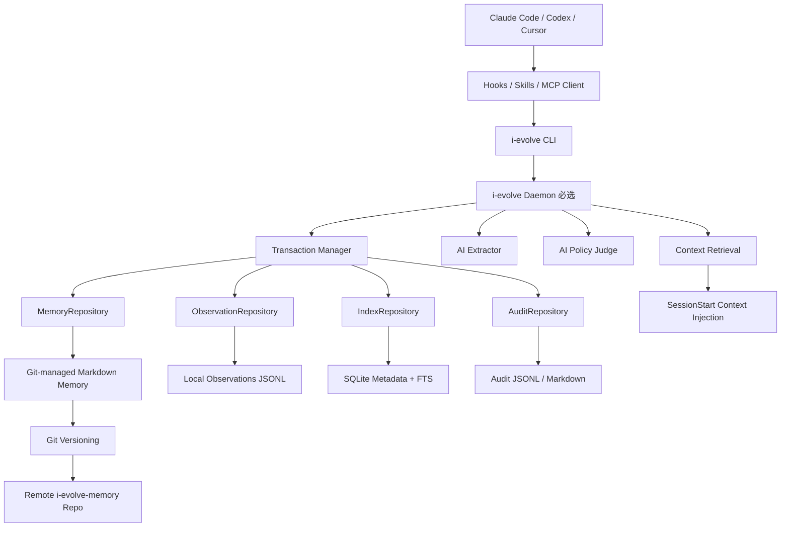
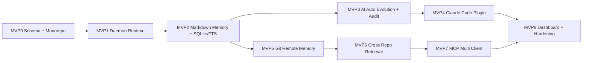

<!--
I-Evolve MVP Implementation Specs
Version: v0.3.1
Date: 2026-06-12
Language: zh-CN
-->

# 00. I-Evolve 总体路线图与架构约束

> 阶段：全局总览  
> 目标：统一 MVP0-8 的架构边界、模块依赖、实施顺序和不可破坏约束。

## 1. 系统定位

I-Evolve 是面向 Claude Code / Codex / Cursor / 其他 Coding Agent 的跨仓记忆系统。它不是普通聊天 Memory，也不是一个膨胀版 `CLAUDE.md`，而是一个以 Git-managed Markdown 为主存储、Daemon 为运行时、SQLite/FTS 为派生索引的工程系统。

核心闭环：

```text
Agent 行为观察
→ Observation 本地记录
→ Session Summary 会话压缩
→ Candidate Memory / Instinct 自动生成
→ AI Policy Judge 自动审核
→ Git-managed Markdown Memory 写入
→ SQLite / FTS 派生索引重建
→ SessionStart 精确召回注入
→ 使用后继续验证、降级、废弃、回滚
```

## 2. 架构总图



## 3. 不可破坏约束

### 3.1 Markdown/Git 是唯一事实源

```text
Memory Source of Truth = Git 管理的一系列 Markdown 文件
SQLite = 本地派生元数据索引
FTS / Vector = 本地派生检索索引
Daemon Runtime = 本地运行状态
Observation = 本地事件材料，不是长期 Memory 主存储
```

禁止：

```text
- 直接把 SQLite 当作长期 Memory 主库。
- 直接从 FTS / vector index 回写 Memory 内容。
- Git 与 Markdown 不一致时优先相信 SQLite。
```

### 3.2 Daemon 是唯一写协调者

```text
CLI 是 daemon client。
Hook 通过 CLI 调 daemon。
MCP 通过 daemon 访问 repository。
Daemon 负责事务、锁、并发、审计、索引更新。
```

### 3.3 AI 自动审核，但不能无审计

```text
Candidate Memory
→ AI Policy Judge
→ active / rejected / scope_downgrade / ttl_adjusted
→ Audit Action
→ Markdown Write
→ Git Commit
```

### 3.4 跨仓 Memory 必须有作用域

所有跨仓召回必须依赖：

```text
repo_id
project_id
domain
tags
applies_to.repo_patterns
applies_to.package_names
applies_to.path_patterns
```

## 4. MVP 依赖关系



## 5. 统一状态机

```ts
export type MemoryStatus =
  | 'candidate'
  | 'active'
  | 'rejected'
  | 'deprecated'
  | 'superseded';
```

```text
candidate → active
candidate → rejected
active → deprecated
active → superseded
superseded → deprecated
```

只有 `active` 可以进入 SessionStart context。

## 6. 统一写入流程

所有 Memory 写入必须走：

```text
Daemon request
→ acquire process lock
→ acquire git workspace lock if needed
→ acquire memory file lock
→ load current memory
→ check expected_revision / expected_content_hash
→ apply mutation
→ validate schema
→ write markdown atomically
→ update SQLite metadata
→ update FTS
→ append audit action
→ optionally git commit
→ release locks
```

## 7. 总体验收

```text
[ ] Memory 主存储只依赖 Markdown/Git。
[ ] SQLite/index 删除后可重建。
[ ] Daemon 是唯一 writer。
[ ] 所有写操作有事务、锁、revision、hash。
[ ] AI 自动审核有 audit log。
[ ] Claude Code 可自动注入 context。
[ ] 远程 Memory 由唯一 Git repo 管理。
[ ] 跨仓召回不污染无关仓库。
[ ] MCP 多客户端共享同一 daemon。
[ ] Dashboard 可查看、回滚、解释 memory。
```
