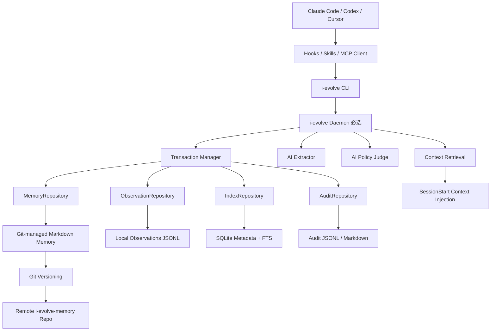
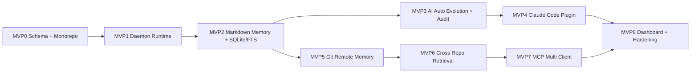

<!--
I-Evolve MVP Implementation Specs
Version: v0.3.1
Date: 2026-06-12
Language: zh-CN
-->

# I-Evolve MVP0-8 依次实现 Spec 合集

> 本文件由多份文档合并生成，便于一次性阅读。


---

<!-- Source: 00-roadmap-and-architecture.md -->


# 00. I-Evolve 总体路线图与架构约束

> 阶段：全局总览  
> 目标：统一 MVP0-8 的架构边界、模块依赖、实施顺序和不可破坏约束。

## 1. 系统定位

I-Evolve 是面向 Claude Code / Codex / Cursor / 其他 Coding Agent 的跨仓记忆系统。它不是普通聊天 Memory，也不是一个膨胀版 `CLAUDE.md`，而是一个以 Git-managed Markdown 为主存储、Daemon 为运行时、SQLite/FTS 为派生索引的工程系统。

核心闭环：

```text
Agent 行为观察
→ Observation 本地记录
→ Session Summary 会话压缩
→ Candidate Memory / Instinct 自动生成
→ AI Policy Judge 自动审核
→ Git-managed Markdown Memory 写入
→ SQLite / FTS 派生索引重建
→ SessionStart 精确召回注入
→ 使用后继续验证、降级、废弃、回滚
```

## 2. 架构总图



## 3. 不可破坏约束

### 3.1 Markdown/Git 是唯一事实源

```text
Memory Source of Truth = Git 管理的一系列 Markdown 文件
SQLite = 本地派生元数据索引
FTS / Vector = 本地派生检索索引
Daemon Runtime = 本地运行状态
Observation = 本地事件材料，不是长期 Memory 主存储
```

禁止：

```text
- 直接把 SQLite 当作长期 Memory 主库。
- 直接从 FTS / vector index 回写 Memory 内容。
- Git 与 Markdown 不一致时优先相信 SQLite。
```

### 3.2 Daemon 是唯一写协调者

```text
CLI 是 daemon client。
Hook 通过 CLI 调 daemon。
MCP 通过 daemon 访问 repository。
Daemon 负责事务、锁、并发、审计、索引更新。
```

### 3.3 AI 自动审核，但不能无审计

```text
Candidate Memory
→ AI Policy Judge
→ active / rejected / scope_downgrade / ttl_adjusted
→ Audit Action
→ Markdown Write
→ Git Commit
```

### 3.4 跨仓 Memory 必须有作用域

所有跨仓召回必须依赖：

```text
repo_id
project_id
domain
tags
applies_to.repo_patterns
applies_to.package_names
applies_to.path_patterns
```

## 4. MVP 依赖关系



## 5. 统一状态机

```ts
export type MemoryStatus =
  | 'candidate'
  | 'active'
  | 'rejected'
  | 'deprecated'
  | 'superseded';
```

```text
candidate → active
candidate → rejected
active → deprecated
active → superseded
superseded → deprecated
```

只有 `active` 可以进入 SessionStart context。

## 6. 统一写入流程

所有 Memory 写入必须走：

```text
Daemon request
→ acquire process lock
→ acquire git workspace lock if needed
→ acquire memory file lock
→ load current memory
→ check expected_revision / expected_content_hash
→ apply mutation
→ validate schema
→ write markdown atomically
→ update SQLite metadata
→ update FTS
→ append audit action
→ optionally git commit
→ release locks
```

## 7. 总体验收

```text
[ ] Memory 主存储只依赖 Markdown/Git。
[ ] SQLite/index 删除后可重建。
[ ] Daemon 是唯一 writer。
[ ] 所有写操作有事务、锁、revision、hash。
[ ] AI 自动审核有 audit log。
[ ] Claude Code 可自动注入 context。
[ ] 远程 Memory 由唯一 Git repo 管理。
[ ] 跨仓召回不污染无关仓库。
[ ] MCP 多客户端共享同一 daemon。
[ ] Dashboard 可查看、回滚、解释 memory。
```


---

<!-- Source: 01-mvp0-core-schema-and-monorepo.md -->


# 01. MVP0：Core Schema 与 Monorepo 骨架

> 目标：建立工程基础，固化 Memory / Observation / Audit / Repository 的数据契约。  
> 非目标：不实现真实 Daemon、不实现 AI、不接 Claude Code、不接 Git remote。

## 1. 交付目标

```text
- pnpm monorepo 可 build / test / typecheck。
- Memory Markdown frontmatter schema 可校验。
- Observation schema 可校验。
- AuditAction schema 可校验。
- Memory / Instinct 状态统一。
- snake_case frontmatter 与 camelCase TS model 有明确 mapping。
- Repository 接口定义完成，但可先不实现真实存储。
```

## 2. Monorepo 目录

```text
i-evolve/
  apps/
    cli/
      src/index.ts
  packages/
    shared/
      src/types.ts
      src/errors.ts
      src/constants.ts
    schema/
      schemas/
        memory.schema.json
        instinct.schema.json
        observation.schema.json
        session-summary.schema.json
        audit-action.schema.json
        project-profile.schema.json
        memory-pack.schema.json
      src/validate.ts
      src/mapping.ts
    core/
      src/model/
        memory.ts
        instinct.ts
        observation.ts
        audit.ts
        session.ts
        project.ts
      src/policy/
        status.ts
        scope.ts
    repository/
      src/interfaces/
        MemoryRepository.ts
        ObservationRepository.ts
        IndexRepository.ts
        AuditRepository.ts
        TransactionManager.ts
  tests/
    fixtures/
```

## 3. 核心类型

### 3.1 MemoryStatus

```ts
export type MemoryStatus =
  | 'candidate'
  | 'active'
  | 'rejected'
  | 'deprecated'
  | 'superseded';
```

### 3.2 MemoryItem

```ts
export interface MemoryItem {
  id: string;
  type:
    | 'user_preference'
    | 'project_fact'
    | 'repo_fact'
    | 'task_constraint'
    | 'decision'
    | 'pitfall'
    | 'workflow_rule';

  scope: 'global' | 'domain' | 'project' | 'repo' | 'task' | 'user';

  repoId?: string;
  projectId?: string;
  domain?: string;

  title: string;
  content: string;
  status: MemoryStatus;
  visibility: 'private' | 'team' | 'public';

  confidence: number;
  ttlDays?: number | null;
  expiresAt?: string | null;

  appliesTo?: {
    repoPatterns?: string[];
    packageNames?: string[];
    pathPatterns?: string[];
  };

  tags: string[];
  sourceRefs: string[];

  revision: number;
  contentHash: string;
  sourceGitCommit?: string;

  supersedes?: string[];
  deprecatedBy?: string | null;

  createdAt: string;
  updatedAt: string;
}
```

### 3.3 Markdown frontmatter

Markdown 主存储使用 snake_case：

```yaml
---
id: project.bilibili-column.old-editor-return-button
type: project_fact
scope: project
project_id: bilibili-column
repo_id: bilibili/column-web
status: active
visibility: team
confidence: 0.91
ttl_days: 180
expires_at: 2026-12-09T00:00:00+08:00
revision: 3
content_hash: sha256:xxxx
source_git_commit: abc123
source_refs:
  - session.20260612.xxx
tags:
  - web
  - editor
applies_to:
  repo_patterns:
    - "bilibili/column-*"
  package_names:
    - "@bilibili/column-web"
  path_patterns:
    - "packages/editor/**"
created_at: 2026-06-12T10:00:00+08:00
updated_at: 2026-06-12T10:00:00+08:00
---
```

## 4. Observation

```ts
export interface Observation {
  id: string;
  timestamp: string;
  sessionId: string;
  repoId?: string;
  projectId?: string;
  cwdHash?: string;
  source: 'claude-code' | 'codex' | 'cursor' | 'cli' | 'mcp';
  phase: 'session_start' | 'pre_tool_use' | 'post_tool_use' | 'stop' | 'manual';
  tool?: string;
  summary: string;
  filesTouched?: string[];
  commands?: string[];
  riskFlags?: string[];
  status: 'success' | 'failure' | 'blocked' | 'unknown';
  sensitivity: 'public' | 'internal' | 'sensitive';
  rawRef?: {
    type: 'local_encrypted_file' | 'none';
    pathHash?: string;
    expiresAt?: string;
  };
}
```

## 5. AuditAction

```ts
export interface AuditAction {
  id: string;
  memoryId: string;
  action:
    | 'propose'
    | 'ai_approve'
    | 'ai_reject'
    | 'activate'
    | 'deprecate'
    | 'supersede'
    | 'forget'
    | 'rollback'
    | 'scope_downgrade'
    | 'confidence_update';
  actorType: 'ai' | 'user' | 'system';
  actorId: string;
  reason: string;
  confidence: number;
  beforeHash?: string;
  afterHash?: string;
  sourceRefs: string[];
  policyChecks: PolicyCheckResult[];
  createdAt: string;
}
```

## 6. Repository 接口

### MemoryRepository

```ts
export interface MemoryRepository {
  get(id: string): Promise<MemoryItem | null>;
  list(filter?: MemoryFilter): Promise<MemoryItem[]>;
  search(query: MemorySearchQuery): Promise<MemorySearchResult[]>;

  create(input: CreateMemoryInput, tx?: Transaction): Promise<MemoryItem>;

  update(
    id: string,
    patch: UpdateMemoryPatch,
    options: {
      expectedRevision: number;
      expectedContentHash: string;
    },
    tx?: Transaction
  ): Promise<MemoryItem>;

  changeStatus(
    id: string,
    status: MemoryStatus,
    action: AuditActionInput,
    options: { expectedRevision: number },
    tx?: Transaction
  ): Promise<MemoryItem>;

  forget(
    id: string,
    mode: 'soft' | 'tombstone',
    action: AuditActionInput,
    tx?: Transaction
  ): Promise<void>;

  rebuildIndex(options?: RebuildIndexOptions): Promise<void>;
}
```

### ObservationRepository

```ts
export interface ObservationRepository {
  append(event: Observation): Promise<void>;
  listBySession(sessionId: string): Promise<Observation[]>;
  listByProject(projectId: string, limit?: number): Promise<Observation[]>;
  archiveBefore(date: string): Promise<void>;
  purgeExpired(): Promise<void>;
}
```

### IndexRepository

```ts
export interface IndexRepository {
  upsertMemory(memory: MemoryItem): Promise<void>;
  removeMemory(memoryId: string): Promise<void>;
  search(query: IndexQuery): Promise<IndexSearchResult[]>;
  rebuildFromMarkdown(source: MarkdownMemorySource): Promise<void>;
  healthCheck(): Promise<IndexHealthReport>;
}
```

## 7. CLI 骨架

```bash
i-evolve --version
i-evolve schema validate <file>
i-evolve schema print memory
i-evolve doctor --bootstrap
```

## 8. 测试

```text
[ ] valid memory markdown 可通过校验。
[ ] missing scope 报错。
[ ] invalid status 报错。
[ ] active memory 缺少 confidence 报错。
[ ] global memory 缺少 ttl_days 或 expires_at 报 warning / fail。
[ ] frontmatter camelCase 字段报错，提示应使用 snake_case。
```

## 9. 验收清单

```text
[ ] pnpm install/build/test/typecheck 成功。
[ ] memory.schema.json 完成。
[ ] observation.schema.json 完成。
[ ] audit-action.schema.json 完成。
[ ] Repository interfaces 完成。
[ ] CLI schema validate 可运行。
```


---

<!-- Source: 02-mvp1-daemon-runtime.md -->


# 02. MVP1：Daemon 必选运行时与写协调基础

> 目标：确立 Daemon 是唯一写协调者，完成进程模型、IPC、锁、事务骨架和基础 Repository wiring。  
> 非目标：不实现 AI 自动提炼、不实现 Git remote push、不实现 Claude Code Plugin。

## 1. 交付目标

```text
- i-evolve daemon start/status/stop 可用。
- daemon 进程级锁可用。
- CLI 可通过 IPC 与 daemon 通信。
- 写操作在 daemon 未运行时拒绝。
- TransactionManager 骨架可用。
- Observation append 可以通过 daemon 写入本地 JSONL。
- Audit append 可以通过 daemon 写入本地 JSONL。
```

## 2. Daemon 进程模型

```text
i-evolve daemon start
  ├─ Process Lock Manager
  ├─ IPC Server
  ├─ Transaction Manager
  ├─ Repository Registry
  ├─ Observation Writer
  ├─ Audit Writer
  ├─ Health Check Worker
  └─ Graceful Shutdown Handler
```

## 3. 本地运行目录

```text
~/.i-evolve/
  config.yaml
  runtime/
    daemon.pid
    daemon.sock
    daemon.lock
  observations/
    current.jsonl
  audit/
    current.jsonl
  logs/
    daemon.log
```

## 4. 进程级锁

锁文件：

```text
~/.i-evolve/runtime/daemon.lock
```

规则：

```text
1. daemon start 前必须尝试获取 lock。
2. 获取失败时检查 pid 是否存活。
3. pid 存活：拒绝启动。
4. pid 不存在：提示 stale lock，并允许 repair。
5. daemon stop 时释放 lock。
```

## 5. IPC 设计

```text
macOS / Linux: Unix Domain Socket
Windows: Named Pipe
Fallback: 不提供写 fallback，仅允许 bootstrap / repair 命令
```

Request：

```ts
export type DaemonRequest =
  | { type: 'ping' }
  | { type: 'health' }
  | { type: 'observe'; payload: Observation }
  | { type: 'audit.append'; payload: AuditAction }
  | { type: 'session.start'; payload: SessionStartInput }
  | { type: 'session.finalize'; payload: SessionFinalizeInput };
```

Response：

```ts
export interface DaemonResponse<T = unknown> {
  ok: boolean;
  data?: T;
  error?: {
    code: string;
    message: string;
    details?: unknown;
  };
}
```

## 6. CLI 行为

允许无 daemon：

```bash
i-evolve daemon start
i-evolve daemon status
i-evolve doctor --bootstrap
i-evolve repair stale-lock
```

必须依赖 daemon：

```bash
i-evolve observe
i-evolve session finalize
i-evolve memory add
i-evolve memory update
i-evolve memory forget
```

daemon 未运行时报错：

```text
Error: i-evolve daemon is not running.
Run: i-evolve daemon start
```

## 7. TransactionManager 骨架

```ts
export interface TransactionManager {
  run<T>(
    name: string,
    options: TransactionOptions,
    fn: (tx: Transaction) => Promise<T>
  ): Promise<T>;
}
```

MVP1 要求：

```text
- 同一 daemon 内写操作串行化。
- 事务有日志。
- 事务失败返回统一错误。
- 后续 MVP2 在此基础上接入 Markdown atomic write。
```

## 8. ObservationRepository 实现

写入：

```text
~/.i-evolve/observations/current.jsonl
```

append 必须：

```text
1. 校验 observation schema。
2. 添加 received_at。
3. 一行一个 JSON。
4. fsync 或安全 flush。
5. 返回 observation id。
```

## 9. AuditRepository 实现

写入：

```text
~/.i-evolve/audit/current.jsonl
```

append 必须：

```text
1. 校验 audit-action schema。
2. 记录 actor。
3. 记录 transaction_id。
4. 一行一个 JSON。
```

## 10. Daemon 命令

```bash
i-evolve daemon start
i-evolve daemon start --foreground
i-evolve daemon stop
i-evolve daemon restart
i-evolve daemon status
i-evolve daemon logs
```

## 11. 测试

```text
[ ] daemon start 后 ping 成功。
[ ] 重复 daemon start 被拒绝。
[ ] daemon stop 后 status 显示 stopped。
[ ] CLI observe 在 daemon 未运行时报错。
[ ] CLI observe 在 daemon 运行时写入 JSONL。
[ ] malformed observation 被拒绝。
[ ] audit.append 可写入 JSONL。
[ ] transaction 失败时返回标准错误。
```

## 12. 验收清单

```text
[ ] Daemon 是唯一写入口。
[ ] daemon lock 生效。
[ ] IPC ping / health 可用。
[ ] ObservationRepository append 可用。
[ ] AuditRepository append 可用。
[ ] TransactionManager 骨架可用。
[ ] daemon 未运行时写操作拒绝。
```


---

<!-- Source: 03-mvp2-markdown-memory-and-sqlite-index.md -->


# 03. MVP2：Markdown Memory 主存储与 SQLite/FTS 派生索引

> 目标：实现 Git-managed Markdown Memory 的本地写入、读取、状态变更，以及 SQLite/FTS 派生索引。  
> 非目标：不实现 AI 自动提炼、不实现 Git remote push、不接 Claude Code。

## 1. 交付目标

```text
- 创建 Memory Markdown。
- 更新 Memory。
- 变更 Memory 状态。
- soft forget / tombstone。
- 从 Markdown 重建 SQLite。
- 用 FTS 搜索 active memory。
```

## 2. 本地 Memory Repo 目录

```text
~/.i-evolve/shared/memory/
  memory-pack.yaml
  global/
  domains/
  projects/
  repos/
  users/
  instincts/
  tombstones/
```

初始化：

```bash
i-evolve memory init-local
```

## 3. Markdown 文件命名规则

```text
{scope}/{namespace}/{slug}.md
```

示例：

```text
projects/bilibili-column/old-editor-return-button.md
repos/column-web/read-before-edit.md
domains/ssr/hydration-checklist.md
global/output-style.md
users/minntaki/output-preference.md
```

## 4. Atomic Write

```text
1. 写入临时文件 `.tmp-{id}-{timestamp}`。
2. fsync 临时文件。
3. rename 到目标路径。
4. fsync 父目录。
5. 更新 SQLite。
6. 更新 FTS。
7. 写 audit action。
```

禁止：

```text
- 直接覆盖目标文件。
- 先更新 SQLite 再写 Markdown。
- schema 校验失败仍写入文件。
```

## 5. 乐观并发控制

每条 Memory 必须有：

```yaml
revision: 1
content_hash: sha256:xxx
```

更新时传入：

```ts
{
  expectedRevision: number;
  expectedContentHash: string;
}
```

规则：

```text
1. 当前 revision 不匹配 → ERR_REVISION_CONFLICT。
2. 当前 content_hash 不匹配 → ERR_CONTENT_HASH_CONFLICT。
3. 更新成功后 revision + 1。
4. 更新成功后重新计算 content_hash。
```

## 6. SQLite Schema

```sql
CREATE TABLE memories (
  id TEXT PRIMARY KEY,
  type TEXT NOT NULL,
  scope TEXT NOT NULL,
  repo_id TEXT,
  project_id TEXT,
  domain TEXT,
  title TEXT NOT NULL,
  status TEXT NOT NULL,
  visibility TEXT NOT NULL,
  confidence REAL NOT NULL,
  ttl_days INTEGER,
  expires_at TEXT,
  revision INTEGER NOT NULL,
  content_hash TEXT NOT NULL,
  file_path TEXT NOT NULL,
  source_git_commit TEXT,
  created_at TEXT NOT NULL,
  updated_at TEXT NOT NULL
);

CREATE TABLE memory_tags (
  memory_id TEXT NOT NULL,
  tag TEXT NOT NULL,
  PRIMARY KEY(memory_id, tag)
);

CREATE VIRTUAL TABLE memory_fts USING fts5(
  memory_id UNINDEXED,
  title,
  content,
  tags
);
```

## 7. Index Rebuild

```bash
i-evolve index rebuild
```

流程：

```text
1. daemon 获取 git workspace lock。
2. 扫描所有 Markdown。
3. 校验 schema。
4. 清空 SQLite memories / tags / FTS。
5. 重新写入 metadata。
6. 重新写入 FTS。
7. 输出 report。
```

## 8. MemoryRepository 实现

```bash
i-evolve memory add --file <md>
i-evolve memory create --type project_fact --scope project --title "..."
i-evolve memory get <id>
i-evolve memory list --status active
i-evolve memory update <id>
i-evolve memory status <id> deprecated
i-evolve memory forget <id> --mode soft
i-evolve memory forget <id> --mode tombstone
i-evolve memory search "关键词"
```

## 9. Forget 语义

### Soft forget

```text
status: deprecated
不再注入
保留原文件
写 audit action
```

### Tombstone

```text
tombstones/{memory_id}.md
```

用于防止同一错误 memory 被再次生成。

## 10. Search 规则

默认只返回：

```text
status = active
expires_at is null or expires_at > now
```

## 11. 测试

```text
[ ] create memory 后 Markdown 文件存在。
[ ] create memory 后 SQLite 有 metadata。
[ ] create memory 后 FTS 可搜到。
[ ] update revision 不匹配时报 conflict。
[ ] 删除 SQLite 后 index rebuild 可恢复。
[ ] schema 错误 Markdown 不进入 index。
[ ] deprecated memory 默认不返回。
[ ] tombstone memory 不会被重新创建同 ID。
[ ] atomic write 中途失败不会留下半文件。
```

## 12. 验收清单

```text
[ ] 本地 memory repo 初始化可用。
[ ] MemoryRepository create/get/list/update/changeStatus/forget 可用。
[ ] Markdown 是唯一主存储。
[ ] SQLite 可从 Markdown 重建。
[ ] FTS 可从 Markdown 重建。
[ ] revision/content_hash 冲突检测可用。
[ ] audit action 写入可用。
[ ] 所有写操作通过 daemon。
```


---

<!-- Source: 04-mvp3-ai-auto-evolution-and-audit.md -->


# 04. MVP3：AI 自动提炼、自动审核与审计日志

> 目标：实现从 Observation / Session Summary 中自动提炼 Candidate Memory / Instinct，并由 AI Policy Judge 自动激活或拒绝。  
> 非目标：不接 Claude Code Hook、不做远程 Git push、不做 MCP。

## 1. 交付目标

```text
Observation
→ Session Summary
→ Candidate Memory / Instinct
→ AI Policy Judge
→ active / rejected / scope_downgrade
→ Audit Action
→ Markdown Memory
→ SQLite/FTS 更新
```

AI 自动审核不是无审核。AI 判断必须有 policy checks、reason、confidence、source_refs、audit log。

## 2. 新增模块

```text
packages/ai-evolution/
  src/extractor/
    SessionSummarizer.ts
    MemoryCandidateExtractor.ts
    InstinctCandidateExtractor.ts
  src/judge/
    PolicyJudge.ts
    ScopeJudge.ts
    TtlJudge.ts
    SensitivityJudge.ts
  src/prompts/
    session-summary.prompt.md
    memory-extractor.prompt.md
    policy-judge.prompt.md
  src/provider/
    AiProvider.ts
    mock-provider.ts
    openai-compatible-provider.ts
```

## 3. Session Summary

```ts
export interface SessionSummary {
  id: string;
  sessionId: string;
  repoId?: string;
  projectId?: string;
  startedAt?: string;
  endedAt: string;
  summary: string;
  decisions: string[];
  constraints: string[];
  mistakes: string[];
  userCorrections: string[];
  filesTouched: string[];
  candidateMemoryHints: string[];
  candidateInstinctHints: string[];
  sensitivity: 'public' | 'internal' | 'sensitive';
  expiresAt: string;
}
```

存储：

```text
~/.i-evolve/sessions/{yyyy-mm}/{session_id}.json
```

规则：

```text
1. Session Summary 默认不进 Git。
2. 默认 TTL 30 天。
3. 不直接长期注入。
4. 只作为 Memory Extractor 输入。
```

## 4. Candidate Memory

```ts
export interface CandidateMemory {
  title: string;
  type: MemoryItem['type'];
  proposedScope: MemoryItem['scope'];
  content: string;
  evidence: string[];
  sourceRefs: string[];
  confidence: number;
  riskFlags: string[];
}
```

Extractor 必须避免：

```text
- 单次任务的临时约束被提升为 global。
- 没有明确证据的用户偏好。
- 含 secret / PII / 原始代码片段的 memory。
- 与已 rejected tombstone 相似的 memory。
```

## 5. Policy Judge

```ts
export interface PolicyDecision {
  decision: 'activate' | 'reject' | 'downgrade_scope' | 'needs_more_evidence';
  finalScope?: MemoryItem['scope'];
  finalType?: MemoryItem['type'];
  confidence: number;
  ttlDays?: number | null;
  expiresAt?: string | null;
  reason: string;
  policyChecks: PolicyCheckResult[];
}
```

规则：

```text
1. confidence < 0.7 默认 rejected 或 needs_more_evidence。
2. task_constraint 默认 ttl_days <= 30。
3. global memory 必须 confidence >= 0.9，且必须有 ttl。
4. user_preference 不允许 visibility=team，除非显式配置。
5. sensitive memory 不允许进入 shared remote。
6. 与 tombstone 相似的 memory 默认 rejected。
```

## 6. Scope 决策表

| 情况 | 推荐 scope | TTL |
|---|---|---:|
| 当前任务明确约束 | task | 7-30 天 |
| 某仓库特有规则 | repo | 90-180 天 |
| 某项目多仓共享规则 | project | 90-365 天 |
| 某技术领域通用规则 | domain | 180 天 |
| 用户稳定输出偏好 | user | 365 天或 null |
| Agent 行为规则 | global / domain instinct | 90-180 天 |

## 7. Policy Checks

```text
1. schema_validation
2. secret_detection
3. pii_detection
4. scope_leakage
5. sensitivity_check
6. duplicate_check
7. tombstone_similarity_check
```

## 8. 审计日志

存储：

```text
~/.i-evolve/audit/{yyyy-mm}.jsonl
```

Audit 示例：

```json
{
  "id": "audit.20260612.xxx",
  "memoryId": "project.bilibili-column.old-editor-return-button",
  "action": "ai_approve",
  "actorType": "ai",
  "actorId": "i-evolve-policy-v1",
  "reason": "规则仅适用于 bilibili-column 项目，不应提升为 global。",
  "confidence": 0.91,
  "sourceRefs": ["session.20260612.xxx"],
  "policyChecks": [
    { "name": "schema_validation", "status": "pass" },
    { "name": "scope_leakage", "status": "pass" },
    { "name": "secret_detection", "status": "pass" }
  ],
  "createdAt": "2026-06-12T10:00:00+08:00"
}
```

## 9. CLI 命令

```bash
i-evolve session finalize --auto-evolve
i-evolve evolve run --session <session_id>
i-evolve evolve dry-run --session <session_id>
i-evolve audit list
i-evolve audit show <memory_id>
i-evolve audit explain <memory_id>
i-evolve memory reject <id>
i-evolve memory deprecate <id>
```

## 10. AI Provider 策略

```ts
export interface AiProvider {
  complete(input: AiCompleteInput): Promise<AiCompleteOutput>;
}
```

默认：

```text
- test 使用 mock provider。
- dev 可配置 openai-compatible provider。
- 不接 embedding。
```

隐私规则：

```text
- sensitive observation 不发送外部 provider。
- rawRef 不发送外部 provider。
- 发送前做 redaction。
```

## 11. 测试

```text
[ ] session finalize 可生成 summary。
[ ] extractor 可生成 candidate memory。
[ ] policy judge 可 activate 高置信 project_fact。
[ ] policy judge 可 reject 低置信 memory。
[ ] task constraint 不会被提升为 global。
[ ] 包含 secret 的 candidate 被 reject。
[ ] 与 tombstone 相似的 candidate 被 reject。
[ ] AI approve 后 Markdown memory 被写入。
[ ] AI reject 后 rejected memory / audit 可查询。
[ ] dry-run 不写入文件。
```

## 12. 验收清单

```text
[ ] Session Summary 可生成并本地保存。
[ ] Candidate Memory / Instinct 可生成。
[ ] AI Policy Judge 可输出结构化 decision。
[ ] active memory 自动写入 Markdown。
[ ] rejected memory 有记录，不进入注入。
[ ] 每次 AI 判断都有 audit action。
[ ] Policy checks 覆盖安全和 scope。
[ ] 所有写入仍经过 daemon transaction。
```


---

<!-- Source: 05-mvp4-claude-code-plugin-hooks-skills.md -->


# 05. MVP4：Claude Code Plugin、Hooks 与 Skills

> 目标：接入 Claude Code，实现真实 Agent 会话中的自动观察、会话结束自动进化、会话开始上下文注入。  
> 非目标：不实现 MCP、不做复杂 Dashboard、不做远程 Git push 强依赖。

## 1. 交付目标

```text
SessionStart
→ i-evolve inject
→ Claude 获得 I-Evolve Context

PostToolUse
→ i-evolve observe
→ Daemon 写 Observation

Stop
→ i-evolve session finalize --auto-evolve
→ AI 自动生成 / 审核 / 激活 Memory
```

## 2. Plugin 目录

```text
packages/claude-plugin/
  .claude-plugin/
    plugin.json
  hooks/
    hooks.json
  skills/
    init/SKILL.md
    remember/SKILL.md
    audit/SKILL.md
    forget/SKILL.md
    explain-memory/SKILL.md
```

## 3. plugin.json

```json
{
  "name": "i-evolve",
  "description": "Cross-repo memory and self-evolution system for Coding Agents.",
  "version": "0.3.1",
  "author": {
    "name": "minntaki"
  }
}
```

## 4. hooks.json

```json
{
  "hooks": {
    "SessionStart": [
      {
        "matcher": "",
        "hooks": [
          {
            "type": "command",
            "command": "i-evolve inject --format markdown"
          }
        ]
      }
    ],
    "PostToolUse": [
      {
        "matcher": "Read|Edit|Write|Bash|Grep|Glob",
        "hooks": [
          {
            "type": "command",
            "command": "i-evolve observe --phase post_tool_use --source claude-code"
          }
        ]
      }
    ],
    "Stop": [
      {
        "matcher": "",
        "hooks": [
          {
            "type": "command",
            "command": "i-evolve session finalize --auto-evolve"
          }
        ]
      }
    ]
  }
}
```

## 5. Inject 命令

```bash
i-evolve inject --format markdown
i-evolve inject --query "SSR 水合审查"
i-evolve inject --max-tokens 2500
```

输出格式：

```md
# I-Evolve Context

## Current Repository
- repo_id: bilibili/column-web
- project_id: bilibili-column
- domain: web-editor

## High Priority Memories
- [project_fact | project | conf=0.91 | id=project.bilibili-column.old-editor-return-button]
  旧版编辑器发布内容进入新版详情页时，需要展示“返回旧版”入口。

## Active Instincts
- [workflow_rule | global | conf=0.88 | id=global.read-before-edit]
  修改文件前必须先读取目标文件。
```

## 6. Context Retrieval MVP4

检索源：

```text
- active memory
- active instinct
- project profile
- recent session summary，短期、低优先级
```

过滤规则：

```text
1. 只注入 active。
2. expires_at 过期不注入。
3. rejected / deprecated / superseded 不注入。
4. scope 不匹配不注入。
```

Top-K 简化策略：

```text
repo scope Top 5
project scope Top 5
domain scope Top 5
user preference Top 3
global instinct Top 5
warnings Top 3
```

## 7. Observation Hook Payload

转换为 Observation：

```ts
{
  id: "obs.xxx",
  phase: "post_tool_use",
  source: "claude-code",
  tool: "Edit",
  summary: "Edited packages/core/src/memory.ts",
  filesTouched: ["packages/core/src/memory.ts"],
  status: "success",
  sensitivity: "internal"
}
```

## 8. Skills

```text
/i-evolve:init
/i-evolve:remember
/i-evolve:audit
/i-evolve:forget
/i-evolve:explain-memory
```

Skill 只负责交互，不直接实现存储。真正实现调用 CLI。

## 9. 性能目标

| 操作 | 目标 |
|---|---:|
| SessionStart inject | < 500ms，最差 < 1s |
| PostToolUse observe | < 100ms |
| Stop finalize | 可较慢，但不能阻塞主流程太久 |
| daemon ping | < 50ms |

## 10. 失败策略

| 场景 | 策略 |
|---|---|
| daemon 未运行 | hook 输出提示，不写入 |
| inject 失败 | 返回空上下文 + warning |
| observe 失败 | 不阻断 Claude 主流程 |
| finalize 失败 | 写入 error audit |
| AI provider 失败 | session summary 保留，稍后重试 |

## 11. 测试

```text
[ ] SessionStart hook 可调用 inject。
[ ] inject 输出不包含 deprecated memory。
[ ] PostToolUse hook 可写 observation。
[ ] Stop hook 可触发 session finalize。
[ ] Claude plugin 文件结构符合要求。
[ ] Skills 文档存在且命令正确。
[ ] daemon 未运行时 Hook 不崩溃。
```

## 12. 验收清单

```text
[ ] Claude Code 启动时可以注入 I-Evolve Context。
[ ] 工具调用后可以记录 observation。
[ ] 会话结束可以自动生成 Memory。
[ ] 自动生成 Memory 可在下一次 SessionStart 中注入。
[ ] 用户可通过 Skill 查看 audit。
[ ] 用户可通过 Skill forget 某条 memory。
```


---

<!-- Source: 06-mvp5-git-remote-memory-versioning.md -->


# 06. MVP5：Git Remote Memory、版本管理与回滚

> 目标：将本地 Memory Repo 与唯一远程 Git Memory Repo 打通，实现 pull、commit、push、版本追踪、回滚和 migration。  
> 非目标：不做多 remote source，不做无 Git 平台 fallback。

## 1. 交付目标

```text
远程 Memory 只有一份。
版本由 Git 管理。
本地 clone 是当前工作副本。
Memory 变更最终都体现为 Git commit。
```

完成后可以：

```text
- 添加唯一 remote memory repo。
- clone / pull / status。
- 自动 commit memory 变更。
- push 到远程。
- checkout tag / commit。
- rollback 到指定 commit。
- Git 变化后重建 SQLite/FTS。
```

## 2. 远程仓库结构

```text
i-evolve-memory/
  README.md
  CHANGELOG.md
  memory-pack.yaml
  global/
  domains/
  projects/
  repos/
  users/
  instincts/
  audit/
    2026-06/
      memory-audit.jsonl
  tombstones/
  migrations/
```

## 3. memory-pack.yaml

```yaml
id: team.default
name: Team Default Memory
schema_version: 2
visibility: team
remote:
  type: git
  default_branch: main
versioning:
  strategy: git
  allow_checkout_commit: true
  allow_checkout_tag: true
sync:
  auto_pull: true
  auto_push: false
ai_review:
  enabled: true
  reviewer: i-evolve-policy-v1
```

## 4. CLI 命令

```bash
i-evolve memory remote init <git-url>
i-evolve memory remote status
i-evolve memory remote pull
i-evolve memory remote push
i-evolve memory remote commit --message "memory(auto): add xxx"
i-evolve memory remote checkout <commit-or-tag>
i-evolve memory remote rollback --to-commit <commit>
i-evolve memory remote log
```

## 5. Git 工作区锁

所有 Git 操作必须获取：

```text
~/.i-evolve/shared/memory/.git/i-evolve.lock
```

保护：

```text
- pull
- push
- commit
- checkout
- rollback
- migration
- index rebuild after commit change
```

## 6. Commit 策略

Commit message：

```text
memory(auto): add project rule for bilibili-column old editor behavior

AI-Reviewer: i-evolve-policy-v1
Decision: activate
Confidence: 0.91
Scope: project
Source-Session: session.20260612.xxx
```

变更类型：

```text
memory(auto): add ...
memory(auto): update ...
memory(auto): deprecate ...
memory(user): forget ...
memory(system): migrate schema ...
```

## 7. Pull 策略

```text
1. 获取 git workspace lock。
2. 检查工作区是否干净。
3. 如果有未提交变更，拒绝 pull。
4. git fetch。
5. git pull --ff-only。
6. 如果失败，生成 conflict report。
7. current_commit 更新。
8. index rebuild。
9. 写 audit action。
```

MVP5 不自动解决 merge conflict。

## 8. Push 策略

```text
1. 获取 git workspace lock。
2. validate memory repo。
3. secret / pii / schema check。
4. 检查是否有 commit 可 push。
5. git push。
6. 写 audit action。
```

如果 validate 失败，禁止 push。

## 9. Rollback 策略

```bash
i-evolve memory remote rollback --to-commit <commit>
```

流程：

```text
1. 获取 git workspace lock。
2. 记录当前 commit。
3. git checkout 或 git revert。
4. 更新 current_commit。
5. rebuild SQLite/FTS。
6. 写 rollback audit action。
```

两种模式：

```text
checkout mode：本地切到指定 commit，适合临时排查。
revert mode：创建反向 commit，适合长期回滚。
```

## 10. Schema Migration

```bash
i-evolve migrate status
i-evolve migrate run
i-evolve migrate run --to 002
```

要求：

```text
1. 必须操作 Markdown 文件。
2. 必须 bump schema_version。
3. 必须写 audit action。
4. 必须生成 Git commit。
5. 必须可 dry-run。
```

## 11. Validate 策略

```text
[ ] memory-pack.yaml 存在。
[ ] schema_version 可识别。
[ ] 所有 Markdown frontmatter 合法。
[ ] id 唯一。
[ ] content_hash 正确。
[ ] active memory 未过期。
[ ] tombstone 不被 active memory 复用。
[ ] secret / pii check 通过。
```

## 12. 测试

```text
[ ] remote init 可 clone repo。
[ ] remote status 显示 current_commit。
[ ] memory 变更可生成 commit。
[ ] validate 失败时禁止 push。
[ ] pull 后自动 rebuild index。
[ ] checkout old commit 后 index 与 old memory 一致。
[ ] rollback 生成 audit action。
[ ] migration dry-run 不写文件。
```

## 13. 验收清单

```text
[ ] 唯一 remote memory repo 可配置。
[ ] pull / push / commit / checkout / rollback 可用。
[ ] Git 版本变化会触发 index rebuild。
[ ] validate 可以阻断错误 memory。
[ ] rollback 后上下文注入使用回滚版本。
[ ] migration 机制可运行。
```


---

<!-- Source: 07-mvp6-cross-repo-retrieval-conflict-topk.md -->


# 07. MVP6：跨仓召回、冲突优先级与 Top-K 注入

> 目标：让 Memory 可以跨仓复用，同时通过 repo_id / project_id / domain / applies_to 和优先级规则防止污染。  
> 非目标：不引入复杂 RAG 系统，不接外部 embedding。

## 1. 交付目标

```text
Memory 是跨仓的，但不能无条件注入。
```

完成后系统可以：

```text
- 自动识别当前 repo_id / project_id / domain。
- 根据 applies_to 匹配跨仓 memory。
- 使用 scope 优先级过滤冲突。
- 使用简单 Top-K 输出稳定上下文。
- 注入上下文带 provenance。
```

## 2. Repo / Project 识别

输入：

```text
- cwd
- git remote url
- package.json name
- go.mod module
- pnpm-workspace.yaml
- project-profile.md
- 用户手动绑定配置
```

输出：

```ts
export interface ProjectIdentity {
  repoId: string;
  projectId?: string;
  domain?: string;
  gitRemote?: string;
  packageNames: string[];
  rootPath: string;
  confidence: number;
}
```

## 3. Project Profile

```text
i-evolve-memory/projects/{project_id}/project-profile.md
```

示例：

```yaml
---
id: project.bilibili-column.profile
type: project_profile
project_id: bilibili-column
repo_ids:
  - bilibili/column-web
  - bilibili/column-admin
domains:
  - web-editor
  - ssr
package_names:
  - "@bilibili/column-web"
status: active
---
```

## 4. applies_to 匹配

```yaml
applies_to:
  repo_patterns:
    - "bilibili/column-*"
  package_names:
    - "@bilibili/column-web"
  path_patterns:
    - "packages/editor/**"
```

匹配规则：

```text
1. repo_id 精确匹配优先。
2. repo_patterns glob 匹配其次。
3. package_names 匹配其次。
4. project_id 匹配其次。
5. domain 匹配再次。
6. global 最后。
```

## 5. 冲突优先级

```text
P0 当前用户显式输入 / 当前任务约束
P1 repo scope memory
P2 project scope memory
P3 domain scope memory
P4 user preference
P5 global workflow rule / instinct
P6 recent session summary
```

冲突处理：

```text
1. scope 越近，优先级越高。
2. 当前任务约束永远高于长期 memory。
3. repo/project 高于 domain/global。
4. deprecated/rejected/superseded 不允许进入 active context。
5. 同一主题多条 memory 只注入最高优先级那条。
6. 同 ID 多版本以当前 Git checkout 为准。
```

## 6. Top-K 策略

默认配额：

```text
repo memory Top 5
project memory Top 5
domain memory Top 5
user preference Top 3
global instinct Top 5
warnings Top 3
recent session summary Top 2
```

评分：

```text
score =
  semantic_or_fts_score * 0.45
  + scope_priority * 0.25
  + confidence * 0.15
  + recency * 0.10
  + usage_success_score * 0.05
```

MVP6 可以只用 FTS score，不接 embedding。

## 7. Provenance 注入格式

```md
- [project_fact | project | conf=0.91 | id=project.bilibili-column.old-editor-return-button]
  旧版编辑器发布内容进入新版详情页时，需要展示“返回旧版”入口。
```

## 8. Conflict Report

```ts
export interface ConflictReport {
  id: string;
  selectedMemoryId: string;
  suppressedMemoryIds: string[];
  reason: string;
  createdAt: string;
}
```

## 9. CLI 命令

```bash
i-evolve identity detect
i-evolve identity bind --project bilibili-column
i-evolve inject --debug
i-evolve memory search "SSR" --explain
i-evolve retrieval explain --memory <id>
```

`inject --debug` 输出：

```text
Matched identity: repo=bilibili/column-web, project=bilibili-column
Candidates: 42
Filtered expired: 3
Filtered scope mismatch: 19
Filtered deprecated: 2
Injected: 18
Suppressed conflicts: 2
```

## 10. 测试

```text
[ ] repo_id 可从 git remote 识别。
[ ] project_id 可从 project-profile 匹配。
[ ] repo memory 优先于 project memory。
[ ] project memory 优先于 domain memory。
[ ] domain memory 可跨相关仓注入。
[ ] 无 applies_to 的 project memory 不跨仓注入。
[ ] deprecated memory 不注入。
[ ] 冲突规则只注入高优先级。
[ ] inject --debug 输出过滤原因。
```

## 11. 验收清单

```text
[ ] 当前仓库身份识别可用。
[ ] applies_to 匹配可用。
[ ] scope priority 可用。
[ ] Top-K 注入可用。
[ ] 注入上下文带 provenance。
[ ] 可解释为什么某条 memory 被注入或被抑制。
[ ] A 仓库规则不会错误注入 B 仓库。
```


---

<!-- Source: 08-mvp7-mcp-multi-client.md -->


# 08. MVP7：MCP Server 与多客户端共享

> 目标：通过 MCP Server 让 Claude Desktop、Cursor、Codex、其他 Agent 共享同一套 I-Evolve Memory。  
> 非目标：MCP 不直接写 Markdown，不绕过 Daemon。

## 1. 交付目标

```text
Claude Code 通过 Hooks 使用 I-Evolve。
Cursor / Codex / Claude Desktop 通过 MCP 使用 I-Evolve。
所有客户端共享同一个 daemon 和同一套 Memory。
```

架构：

```text
MCP Client
→ i-evolve-mcp-server
→ daemon IPC
→ Repository Layer
→ Markdown Memory / SQLite Index
```

## 2. 目录结构

```text
apps/mcp-server/
  src/server.ts
  src/tools/
    recall.ts
    remember.ts
    forget.ts
    searchMemory.ts
    auditMemory.ts
    explainMemory.ts
    syncMemory.ts
  src/daemon-client.ts
```

## 3. MCP Server 运行方式

```bash
i-evolve mcp start
i-evolve mcp start --stdio
i-evolve mcp status
```

MCP server 启动时必须检查 daemon：

```text
1. daemon running → 正常启动。
2. daemon not running → 返回错误，提示先启动 daemon。
```

## 4. MCP Tools

### recall

输入：

```json
{
  "query": "SSR 水合审查",
  "cwd": "/path/to/repo",
  "maxTokens": 2000
}
```

输出：

```json
{
  "context": "# I-Evolve Context...",
  "memories": [
    {
      "id": "project.xxx",
      "scope": "project",
      "confidence": 0.91,
      "reason": "project_id matched"
    }
  ]
}
```

### remember

```text
MCP remember
→ daemon
→ candidate memory
→ AI policy judge
→ active/rejected
→ audit
```

### forget

```json
{
  "memoryId": "project.xxx",
  "mode": "soft"
}
```

### search_memory / audit_memory / explain_memory / sync_memory

用于搜索、审计解释和触发同步。

## 5. 权限与安全

MVP7 简化：

```text
- MCP server 只允许本机访问。
- 不暴露公网 HTTP。
- 通过 daemon socket 通信。
- 所有写操作仍走 transaction。
```

## 6. 多客户端并发

场景：

```text
Cursor 通过 MCP remember。
Claude Code Stop hook 同时 auto-evolve。
CLI 同时 memory forget。
```

要求：

```text
- daemon transaction 串行化冲突写。
- Memory revision 冲突返回标准错误。
- MCP 返回可读错误。
```

## 7. MCP Response 原则

```json
{
  "ok": true,
  "data": {},
  "warnings": [],
  "auditId": "audit.xxx"
}
```

错误：

```json
{
  "ok": false,
  "error": {
    "code": "ERR_DAEMON_NOT_RUNNING",
    "message": "I-Evolve daemon is not running."
  }
}
```

## 8. 测试

```text
[ ] daemon 未运行时 MCP 启动失败。
[ ] recall tool 可返回 context。
[ ] remember tool 可触发 candidate → active。
[ ] forget tool 可 soft forget。
[ ] search_memory 可搜索 FTS。
[ ] explain_memory 可返回 audit 信息。
[ ] MCP 与 CLI 并发更新同一 memory 触发 revision conflict。
```

## 9. 验收清单

```text
[ ] MCP server 可启动。
[ ] MCP 通过 daemon 访问 repository。
[ ] recall / remember / forget / search / audit / explain 可用。
[ ] 多客户端共享同一 Memory。
[ ] MCP 不绕过 daemon 写存储。
[ ] 并发冲突可被 daemon 识别。
```


---

<!-- Source: 09-mvp8-dashboard-hardening-release.md -->


# 09. MVP8：Dashboard、治理加固与发布工程

> 目标：将 I-Evolve 从可用工具推进到可维护、可解释、可回滚、可分发的产品化系统。  
> 非目标：不改变 Markdown/Git 主存储原则，不绕过 Daemon。

## 1. 交付目标

```text
- Dashboard 查看 Memory、Audit、Conflicts、Daemon、Git 状态。
- 可视化回滚和 forget。
- doctor / audit / validate / repair 完整化。
- release pipeline 和版本策略。
- 污染测试、安全测试、回归测试完善。
```

## 2. Dashboard 范围

```text
apps/dashboard/
  src/
    pages/
      Memories.tsx
      MemoryDetail.tsx
      Audit.tsx
      Conflicts.tsx
      DaemonStatus.tsx
      GitStatus.tsx
      Settings.tsx
    api/
      daemonClient.ts
```

Dashboard 只连接本地 daemon。

禁止：

```text
- Dashboard 直接读写 Markdown。
- Dashboard 直接操作 Git。
- Dashboard 绕过 daemon transaction。
```

## 3. 页面设计

### Memories

```text
- 列表查看 active / rejected / deprecated / superseded。
- 按 scope / project / repo / domain 过滤。
- 搜索 Memory。
- 查看 confidence、expires_at、revision。
```

### Memory Detail

```text
- 查看 Markdown 内容。
- 查看 frontmatter。
- 查看 audit timeline。
- 查看 source_refs。
- 查看注入历史。
- 执行 deprecate / forget / rollback。
```

### Audit

```text
- 查看 AI 自动审核记录。
- 查看 policy checks。
- 查看被 reject 的候选。
- 查看 scope_downgrade 原因。
```

### Conflicts

```text
- 查看冲突规则。
- 查看被抑制的 Memory。
- 查看选择原因。
```

### Daemon / Git Status

```text
- daemon uptime。
- transaction success/failure。
- index health。
- current commit。
- remote branch。
- dirty files。
- unpushed commits。
- last pull time。
```

## 4. Daemon API for Dashboard

```text
GET /health
GET /memories
GET /memories/:id
GET /audit
GET /conflicts
POST /memories/:id/forget
POST /memories/:id/deprecate
POST /memories/:id/rollback
GET /git/status
POST /git/pull
POST /git/push
POST /index/rebuild
```

如果不提供 HTTP，也可以通过本地 IPC bridge。

## 5. Doctor 完整化

```bash
i-evolve doctor
```

检查：

```text
[ ] CLI version
[ ] daemon running
[ ] local directory
[ ] memory repo exists
[ ] git status clean
[ ] schema version
[ ] sqlite health
[ ] fts health
[ ] audit log health
[ ] Claude plugin installed
[ ] MCP server status
[ ] remote memory status
```

## 6. Repair 命令

```bash
i-evolve repair stale-lock
i-evolve repair rebuild-index
i-evolve repair verify-hashes
i-evolve repair audit-log
i-evolve repair git-cleanup
```

规则：

```text
- repair 必须尽量可 dry-run。
- repair 不能静默删除 Memory。
- repair 需要写 system audit。
```

## 7. 安全加固

```text
- Git push 前检查 secret / PII。
- Memory create 前检查 secret / PII。
- AI candidate approve 前检查 secret / PII / scope leakage。
- 外部 AI Provider 必须显式 opt-in。
- sensitive observation 不外发。
- rawRef 不外发。
```

## 8. 发布策略

代码版本：

```text
i-evolve-cli@0.3.1
i-evolve-daemon@0.3.1
i-evolve-core@0.3.1
i-evolve-mcp-server@0.3.1
i-evolve-claude-plugin@0.3.1
```

Memory 版本：

```text
i-evolve-memory Git tag: memory-2026.06.12
```

原则：

```text
代码版本和 Memory 内容版本不绑定。
schema_version 通过 migration 管理。
Git commit 是 Memory 精确版本。
```

## 9. Release Checklist

```text
[ ] pnpm build
[ ] pnpm test
[ ] pnpm typecheck
[ ] schema fixtures pass
[ ] integration tests pass
[ ] pollution tests pass
[ ] security checks pass
[ ] migration dry-run pass
[ ] npm package dry-run pass
[ ] Claude plugin package pass
[ ] MCP server smoke test pass
```

## 10. 污染测试

```text
[ ] task constraint 不会提升为 global。
[ ] rejected memory 不会再次高频生成。
[ ] deprecated memory 不会被注入。
[ ] repo A memory 不会注入 repo B。
[ ] domain memory 可以跨相关 repo 注入。
[ ] Git rollback 后 SQLite/index 能重建。
[ ] AI 自动审核有 audit action。
[ ] secret / PII / internal path 不会进入 shared memory。
[ ] 同一 memory 并发修改会触发 revision conflict。
[ ] daemon 未启动时写操作失败。
```

## 11. E2E 场景

### 单仓闭环

```text
1. 启动 daemon。
2. 初始化 memory repo。
3. Claude Code SessionStart inject。
4. PostToolUse observe。
5. Stop finalize。
6. AI 自动生成 active memory。
7. 下一次 SessionStart 注入该 memory。
```

### 跨仓召回

```text
1. 在 repo A 生成 domain memory。
2. 切换到 repo B。
3. repo B 匹配 same domain。
4. domain memory 被注入。
5. repo A 特有 memory 不注入。
```

### 回滚

```text
1. 生成错误 memory。
2. Git commit。
3. 通过 Dashboard rollback。
4. index rebuild。
5. inject 不再出现错误 memory。
```

## 12. 验收清单

```text
[ ] Dashboard 可查看 Memory。
[ ] Dashboard 可查看 Audit。
[ ] Dashboard 可查看 Git / Daemon 状态。
[ ] Dashboard 可执行 forget / deprecate / rollback。
[ ] doctor / repair 完整可用。
[ ] release checklist 可跑通。
[ ] 污染测试覆盖核心风险。
[ ] 安全检查覆盖 secret / PII / scope leakage。
[ ] 项目具备发布 npm 包和插件包能力。
```
